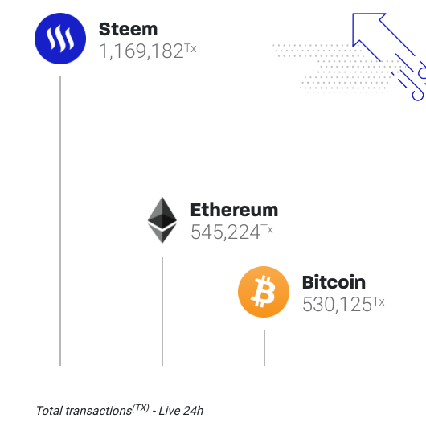

> Enter early to he a HERO

## Notable decentralized applications

* dtube[^1]
  * Ad free
* STEEM
  * social blockchain ~ etherium
  * Free Transactions
* [Publish0X](https://www.publish0x.com/)
  * earn money for creators and readers
* [TrustWallet](https://trustwallet.com/)

## Resources

* [IPFS](https://en.wikipedia.org/wiki/InterPlanetary_File_System)

### Footnotes

[^1]: [dtube](https://about.d.tube/)
[^2]: [steem](https://steem.com/)
