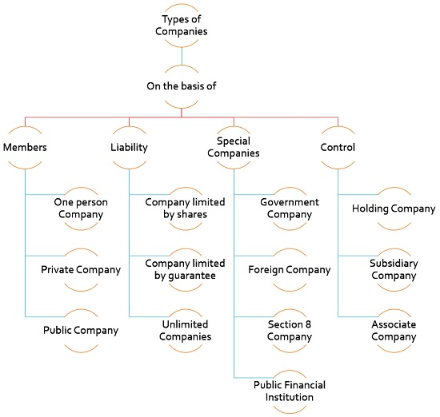
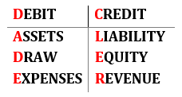
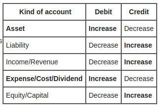

## what is Sole proprietorship?

* aka sole trader, individual entrepreneurship or proprietorship
* owned and run by one person[^1]
* there is no legal distinction between the owner and the business entity
* The sole trader receives all profits (subject to taxation specific to the business) and has unlimited responsibility for all losses and debts.
* may use a trade name or business name other than their or its legal name. They may have to legally trademark their business name if it differs from their own legal name, the process varying depending upon country of residence.[2]
* complete a form submitted to the governing authority to acquire title as a **DBA** or "doing business as”
* The license for a sole proprietary business entitles the owner to hire employees and enlist the services of independent consultants.
  * their contribution to the project or decision is considered a recommendation under the law.
<!-- more -->

## Requirements

How to register a company in India?[^2]

1. [X] PAN Card (your)
2. [X] SB/Current Bank Account
   1. Current bank A/C
3. [ ] **GST NUmber** if turnover > **20L/annum**[^3]
   1. online business (selling through amazon, flipkart etc.), you are required to get a GST number. For registering under GST, you need the following documents –
      1. PAN card, Photo and Aadhar Card of the proprietor
      2. Proof of business place (Electricity bill/ rent agreement)
      3. Bank statement copy (first page for verifying bank account number, address and IFSC code)
   2. GST registration is easy and can be done via the GST portal. Normally GST number is received within 3-4 days of submitting the application.[^3
4. [X] ADHAAR Card
5. [ ] Business Registration Form
   1. Ministry of Micro/medium and small enterprises
6. [ ] Business name must not violate any TradeMarks
7. [ ] Warehouse and business Address
8. [ ] Main activity of business
9.  [ ] Phone number to recieve OTP

#### Advantages

1. Easy to setup
2. TAX **18%** on GST

#### CONS

1. Limited Liability Protection
2. D0esnt scale

## Types of companies

* Public Company (or Public Limited Company)
* Private Company (or Private Limited Company)
* One Person Company
* Sole proprietorship Firm
* Royal Chartered Companies
* Statutory Companies
* Registered or Incorporated Companies
* Companies Limited By Shares
* Companies Limited By Guarantee
* Unlimited Companies

## Book keeping

* https://www.waveapps.com/pricing
* https://knackbusiness.com/pricing
* Using a SHeet Template, record transactions as they happen
  * Keep reciepts digitally
  * Great for Tax Filings

## Accounting

A student buys a computer for **$900**. To pay for the computer, the student uses **$400** in cash and borrows **$500** for the remainder.
Now his **assets** are worth $900,
**liabilities** are $500, and **equity** $400.

[capital](https://en.wikipedia.org/wiki/Capital_(economics))
: In economics, capital consists of assets that can enhance one's power to perform economically useful work

Liability
: future sacrifices of economic benefits that the entity is obliged to make to other entities as a result of past transactions or other past events

[Asset](https://en.wikipedia.org/wiki/Asset)
: is any resource owned by the business.
* Anything tangible or intangible that can be owned or controlled.
* assets are recorded on the left-hand side (debit) of asset accounts,

[Equity](https://en.wikipedia.org/wiki/Equity_(finance))
: For example, if someone owns a car worth $15,000 (an asset), but owes $5,000 on a loan against that car (a liability), the car represents $10,000 of equity.
* Equity can be negative if liabilities exceed assets.

[Shareholder](https://en.wikipedia.org/wiki/Shareholder)
: legally owns one or more shares of stock in a public or private corporation.
* Legally, a person is not a shareholder in a corporation until their name and other details are entered in the corporation's register of shareholders or members.[

[Debits and Credits](https://en.wikipedia.org/wiki/Debits_and_credits)
: In double entry bookkeeping, debits and credits (abbreviated Dr and Cr, respectively) are entries made in account ledgers to record changes in value resulting from business transactions
* The words debit and credit can sometimes be confusing because they depend on the point of view from which a transaction is observed.

[Dividend](https://en.wikipedia.org/wiki/Dividend)
: A dividend is a payment made by a corporation to its shareholders, usually as a distribution of profits.

$$
Net Income = Income − Expenses
$$

* Balancesheet
* Accounting Basics - **D**ebit and **C**redit
  * `DC ADE LER`
    * **D**ebit / **C**redit
      * Neither good or bad
    * **A**sset
      * cash
      * Account recievable
      * Inventory
      * Equipment
      * Buildings
    * **D**raw
    * **E**xpenses
      * Rent
      * Utilities
      * Tele
      * Internet
    * **L**iability - payable
    * **E**quity - owners
      *
    * **R**evenue
      * sales
      * service
  * Every journal entry will have at leat 1 debit or 1 credit
* Journal entry - 1000 loan from bank
  * Debit and credit side must be equal
  * Load is asset 1000 (debit) = Liability 1000 (credit)

#### fundamental accounting equation

aka [balance sheet equation](https://en.wikipedia.org/wiki/Accounting_equation)

$$
Asset = Liability + Equity
$$

## Where to register business?

1. India[^2]
2. Germany
3. [Estonia](https://www.emta.ee/eng/business-client/income-expenses-supply-profits/tax-rates)[^4]

## e-residency Estonia

> you cannot avoid paying taxes in yoru country of residence

* Launched in 2014
* **20%** Income Tax
* Lets you operate in EU from anywhere in the world
* Prime users
  * Guy Kawasaki
  * Japanese prime minister
  * Bam Margera - 3D printing
  * Former US President Barack Obama has an Estonian ID card
* Fee = **100** euros + **30 euros** card shipping to embassy
* Might take a month
* Access to european banking
* **~200 euros** per month maintaining the account, filing reports
* European trading

## Freelancers

> Trade and freelancers

* People who rely on the transfer of knowledge like humanities, doctor, lawyer
* You can work as both, then you will need 2 TAX numbers
* you would need **atleast 3 contracts in german** - german clients
* Letter of recommendations and Portfolios
* Financial plan - how much you have and how much will you spend

### Footnotes

[^1]: https://en.wikipedia.org/wiki/Sole_proprietorship
[^2]: https://udyogaadhaar.gov.in/UA/PrintAcknowledgement_Pub.aspx
[^3]: http://www.gstcouncil.gov.in/
[^4]: https://e-resident.gov.ee/become-an-e-resident
