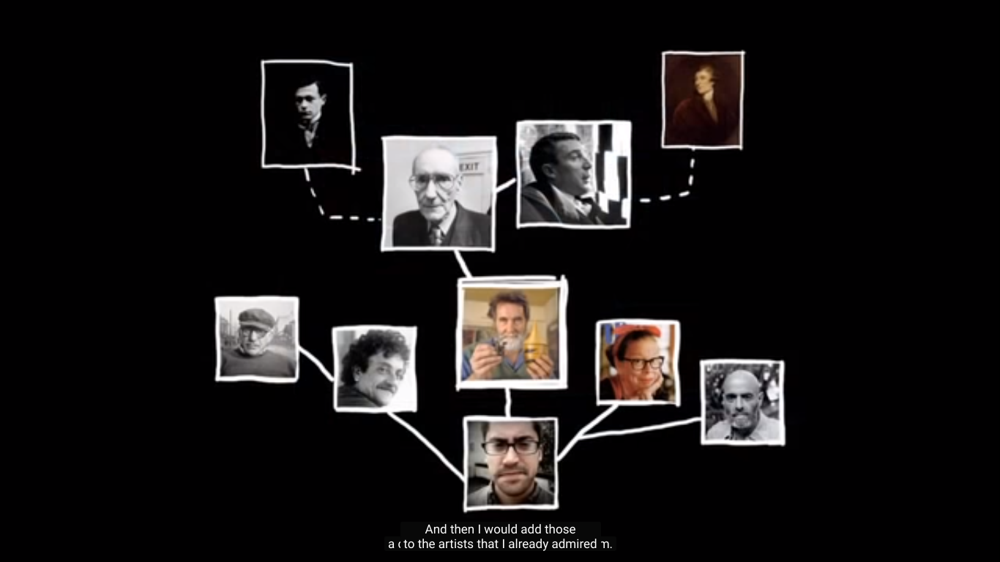
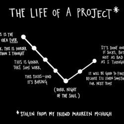

## Book of Dashboards

1. Steal like an Artist
   1. DIfference b/w  plaigraism and taking isnpiration
2. Each graph should answer a business question
3. Use graphs wisely for particular data representation, each graph has its pros and cons
4. Sequential Color - Highlights (Use 3 max)
5. Design to grids, and use contrast to navigate eye - Bigger, medium and smaller objects
   1. Layout designs
6. Decultter - remove labels borders, highlight parts only you are intertested
7. 3 level Font scheme - Use big bad ass numbers / Summary bands on TOP (eye-tracking research)

{}
For the largest number of people, provide the greatest degree of understanding and value,
with least amount of work.
{}

## Steal Like an Artist

> An Artist is a Collecter. Selective collection
> Creative Kleptomaniac

* [Tom Phillipe humumnet](http://www.tomphillips.co.uk/)

$$ { 1 + 1 = 3 } $$


Nothing is completely original. Everything is built on top of something.


### Footnotes

1. [tableau dashboards  ](https://help.tableau.com/current/pro/desktop/en-us/dashboards.htm)