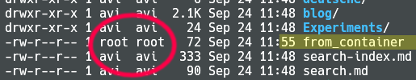

Volumes
: in dockers well very much like regular unix base mounting works.
* Not practical to remove and recreate dockers on every code change

* Docker already caches files in layers with hash
* When you run an image and generate a container, you add a new **writable layer** (the “container layer”) on top of the underlying layers.
* Only the instructions `RUN`, `COPY`, `ADD` create layers.
* For the `ADD` and `COPY` instructions, the contents of the file(s) in the image are examined and a checksum is calculated for each file.
* Use [alpine](https://hub.docker.com/_/alpine/) as base image
* The `VOLUME` instruction should be used to expose any **database storage area**, **configuration storage**, or **files/folders created by your docker container**. You are strongly encouraged to use VOLUME for any mutable and/or user-serviceable parts of your image.
* The `VOLUME` instruction creates a mount point with the specified name and marks it as holding externally mounted volumes from native host or other containers.
  * The host directory is declared at container run-time: The host directory (the mountpoint) is, by its nature, host-dependent. This is to preserve image portability, since a given host directory can’t be guaranteed to be available on all hosts. For this reason, you can’t mount a host directory from within the Dockerfile. The VOLUME instruction does not support specifying a host-dir parameter. You must specify the mountpoint when you create or run the container.
* 

> Where are docker images and layers stored on system ?

```
docker info
/var/snap/docker
```

> DIfference between ADD and COPY

The `ADD` instruction copies new files, directories or remote file URLs from <src> and adds them to the <mark>filesystem of the **image**</mark> at the path <dest>.

The `COPY` instruction copies new files or directories from <src> and adds them to the <mark>filesystem of the **container**</mark> at the path <dest>.

> How to keep local directory synchronized within container directory?

* --bind
* `--volume`

> HANDLING PERMISSIONS WITH DOCKER VOLUMES



1. If you write to the volume you won't be able to access the files that container has written because the process in the container usually runs as root.
2. You shouldn't run the process inside your containers as root but even if you run as some hard-coded user it still won't match the user on your laptop/jenkins/staging.

```
# Create a localuser in container

ARG USER_NAME=avi
ARG USER_ID=1000
ARG GROUP_NAME=avi
ARG GROUP_ID=1000
RUN groupadd --gid $GROUP_ID $GROUP_NAME \
    && useradd --uid $USER_ID --gid $GROUP_ID $USER_NAME
USER $USER_NAME
COPY . /blog
WORKDIR /blog
VOLUME [ "/blog", ]
```

### Footnotes

[^1]:
[^2]:
