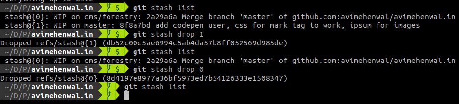

## Software Release

Before getting deeper in to git tags, lets first understand the
basics information provided by a software package to its users.

### Components of a release[^1]

* release notes and
* a packaged software bundle or binaries

### What are git tags exactly and why need them?

[Git tags](https://git-scm.com/book/en/v2/Git-Basics-Tagging) are specific points
in the history of your repository, which you might want to rollback in case anything bad happens.

Usually git commit trees grow long very quickly and it might be daunting to remember the
goog commit from the bad ones. Thats where git tags comes in handy and they are excellent in
labelling the **commits of interest**

Versions in Github are based on Git tags


### How to we tag out git commit tree?

A good and standard approach is to follow the **Version Semantics scheme**[^2]

{}    
$$ MAJOR.MINOR.PATCH $$

MAJOR
: version when you make incompatible API changes,

MINOR
: version when you add functionality in a backwards-compatible manner, and

PATCH
: version when you make backwards-compatible bug fixes.

Additional labels for pre-release and build metadata are available as extensions to the MAJOR.MINOR.PATCH format.
{}

### How to add tags to repositories?

Tags could be easily added to git worktree using following commands:
```
// syntax format
git tag -a <tagname> -m <tag short description>

// example
git tag -a v0.5 -m "Release 0.5 with updated search API"

// view all tags
git tag -l

// dealing with remote tags on Github
git push origin <tag name>
git push origin v0.5
git push --tags
```

git tag command other switches
> **-a** add tag

> **-l** list tags

> **-d** delete tag


[NOTE] you cannot checkout tags in git BUT you can create a branch from a tags

```
git checkout -b <branchname> <tagname>
```

#### creating tags from previous commits
```
git tag <tagname> <commitreference>
```

#### Remote tags 
```
# List all remote tags
git ls-remote --tags

# Delete a remote tag
git push --delete origin <tagname>
```

#### How to rename a tag or edit its message
```
# Renaming tag by aliasing and then deleting OLD
git tag NEW OLD
git tag -d OLD

# use -f to update existing message
git tag <tagname> -m "new message" -f
git push --tags -f
```

## Git stash

cleaning up worspace until your last commit.

+ Useful when you made changes in wrong branch
  + simply stash
  + checkout to right branch
  + stash pop from stach your changes to current branch

### Removing stashes when not required

We can view the changes which stash will bring before applying it using `show -p`

```git
    git stash
    git stash list
    git stash show -p <stash-number>
    
    git stash pop
    git stash apply <stash-number>

    git stash drop <stash-number>
```



## References
* [^1]: [Github creating releases](https://help.github.com/articles/creating-releases/)
* [^2]: [Semantic Versioning 2.0.0](https://semver.org/)
