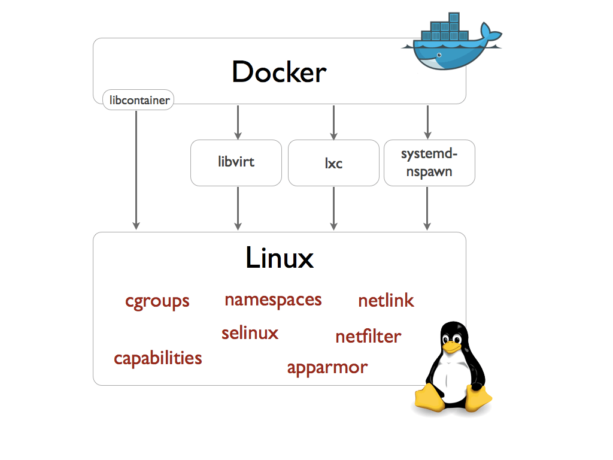
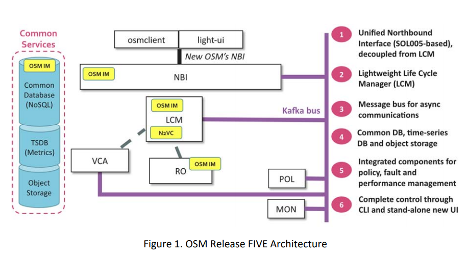

SO / RO
: Service and Resource Orchestration
* Now replaced by NBI

VDU
: Virtual Deployment Unit

juju
: Juju is an open source application modelling tool. With it, you can deploy, configure, scale, and operate your software on public and private clouds

charm
: is a set of action and hooks
+ `actions` are programs
+ `hooks` are events and signals

[LXC - Linux Containers](https://en.wikipedia.org/wiki/LXC)
: is an **operating-system-level virtualization method** for running multiple isolated Linux systems (containers) on a control host using a **single Linux kernel**
* `cgroups` limitation and prioritization of resources (CPU, memory, networking)
* `namespace isolation` isolation of working environment including `processes`, `networking`, `users` and `filesystems`

LXD
: system container manager.
* Hypervisor, but for linux containers
* [Uses prebuilt images](https://uk.images.linuxcontainers.org/)
* Under the hood, LXD uses `LXC` through liblxc and its Go binding to create and manage the containers.
+ `LXD` container to run `juju`

[Read more about containers]()

[There are several isolation programs available](https://blog.docker.com/2014/03/docker-0-9-introducing-execution-drivers-and-libcontainer/)





* ETSI-hosted open source management and orchestration (MANO) community project
* `yang` parser to parse `NTCONF`
* git pull --rebase before pushing changes
* OSM `commit-msg` hook
* [Run OSM on vagrant](https://osm.etsi.org/wikipub/index.php/How_to_run_OSM_on_Vagrant)

In order for OSM to work, it is assumed that:

+ Each VIM has an API endpoint reachable from OSM
+ Each VIM has a so called management network which provides IP address to VNFs
+ That management network is reachable from OSM
+ `OSM client`, a python-based CLI for OSM, will be available as well in the host machine. Via the OSM client, you can manage descriptors, NS and VIM complete lifecycle.[^6]

### Supported VIMs[^6]

1. OpenVIM
2. OpenStack
3. VMware vCloud
4. AWS

{}
we can add VIMs into OSM either by **client** or **UI**[^6]
{}

### OSM directories

* /usr/share/osm-devops/
* /etc/osm - db password and all


## NBI - North Bound Interface[^1]

* REST-full following ETSI SOL005 standard
* Runs inside a docker container
* Basic authentication or no authentication is also possible changing 'nbi.cfg' file
* From the architecture it looks like `osmclient` and `lightui` are using NBI
* `management network` (sometimes called OAM network) is created

## CURL requests

```
curl \
    --progress-bar \
    --header "Accept: application/json" \
    -H "Content-Type: application/json" \
    -H "Authorization: Bearer <token_id>" \
    --data @data.json \
    --request GET/POST \
www.google.com
```

### Self signed certificates

To be able to serve a site on HTTPS from localhost you need to create a self-signed certificate[^9].


### Capabilities of vim-emu? What can it do?

*

### Footnotes

[^1]: https://osm.etsi.org/wikipub/index.php/OSM_Release_SIX_Documentation
[2]: [Pyang a NETCONF parser](https://github.com/mbj4668/pyang)
[3]: [NETCONF RFC](https://tools.ietf.org/html/rfc6241)
[4]: [Examples of hackerfest](https://osm.etsi.org/wikipub/index.php/Examples_from_OSM_Hackfests#Hackfest_material)
[5]: [OSM source code](https://osm.etsi.org/gitweb/)
[^6]: [Installation via apt, vagrant](https://osm.etsi.org/wikipub/index.php/OSM_Release_SIX)
[7]: [Day-0, day-n configuration](https://community.cisco.com/t5/nso-developer-hub-blogs/day-1-day-0-day-1-day-2-n-configurations/ba-p/3658255)
[8]: [connecting openstack to osm](https://osm.etsi.org/wikipub/index.php/Openstack_configuration)
[^9]: [Self-signed_certificate](https://en.wikipedia.org/wiki/Self-signed_certificate)
