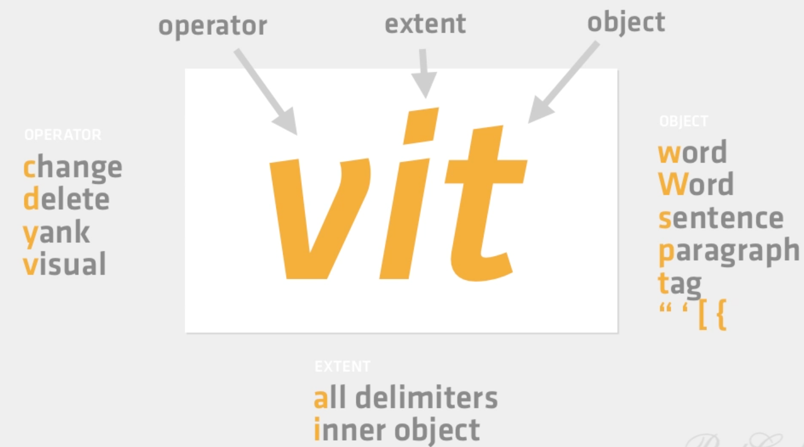

# The VIM Language

> verbs - nouns - data objects



#### How To Make Editing Fast

1. Find the task which takes time and you use frequently. Detect inefficiency
2. Find a better, smarter way
3. Make it a habit

- `:e .` => Directory listing
- All capital versions of keystrokes are bigger versions
- `:verbose set list?` => from where variable is getting set. Dot file or plugin
- `:options` => All vim setting options
- `:set` => Options default values
- `:help Filetypes` => details on filetypes vim config
- Buffers + unsaved changes = read only % buffer in current window :ba open all buffers :bl :bf :bp :bn :bd
- %a active buffer # Alternate buffer ctrl-^ switching between current and alternate buffers
- #h + => Hidden buffer with unsaved changes. Happens when :bn! without saving buffer. :w :bd! :e! :q!
- :set hidden to solve hidden buffers problem
- Scroll moving current line zt => top zb => bottom zz => middle
- Use o in visual modes (jumping between ends) vit => Text object
- Search highlight no of highlights /h1/+1 offset /useful/e+3
- Use searches to add, delete, yank or modify/substitute in search patterns
- g/bacon/normal Obacon is good => run normal mode command after each search pattern
- Search pattern are save in / register => vim-ack => vim grep
- Key mappings for convenience :vamp, :imap, :nmap, :map, :noremap
- Vim Abbreviations :ab :cab abbreviations in Insert mode :abc => clear all abbreviations
- Vim Folding: indent or syntax :set foldmethod=syntax  zx zc zo zR zM za :set foldcolumn=1 
- Vim Filters :%!uniq built-in :1,$ sort Autoindent with ggVG = command
- Centre documentation text with ce gq :set paste
- Eight types of registers. 48 different types of registers. Sent registers commands.
- “” Unnamed register store most recent operation
- For yanking user digits register “0. :register “+ => system clipboard  “* => visual clipboard
- @ => executes content of given register. : => uses register as the text of the command
- `:daw` delete a word in normal mode
- `:caw` delete a word and land in insert mode


## quick Navigation and jumping around

scrolling relative to cursor
: `zz`, `zt`, `zb`

scrolling page
: half-page down <kbd>CTRL + d</kbd> and up <kbd>CTRL + u</kbd>
* full page backward <kbd>CTRL + b</kbd> and forward <kbd>CTRL + f</kbd>

#### page navigation

* Want to move the cursor to the next word? Press `w`.
* Want to move to the 3rd occurrence of the letter 'h'? Press `3fh`.
* Want to move 35 lines downwards? Press `35j`.
* After one of the above movements, want to jump back to the previous location? Press <kbd>ctrl-o</kbd>
* Press H to jump as **H**igh as possible (first line of the window)
* Press M to jump to the **M**iddle of the window
* Press L to jump as **L**ow as possible (last line being displayed)
* `()` To move to the next sentence
* `{}` To move between the paragraphs
* `‘` get to mark m<mark_name> create a mark
* ^o ^i Jump previous and Jump Next
* `~` Toggle text case


#### Some use-cases

> Using VIM Feels like a TEXT SURGEON
> Repetitions are BAD and could be programmed

you accidentally typed "accifentally". No problem, the sequence Esc FfrdA will correct the mistake and bring you back where you’ve been editing it

you accidentally typed "you accidentally typed", but want to correct it to "you intentionally typed". Then Esc 2bcw will erase the word you want to fix and bring you to insert mode, so you can immediately retype it. To get back to editing, just press A instead of End, to reach which you should move your hand

you accidentally typed "mouse" instead of "mice". No problem - the good old Ctrl+W will delete the previous word without going out from insert mode. And it happens to be much faster to erase small word than to fix errors in it. I'm so used to it that I had closed the browser page when I was typing this message...

repetition count is largely underused. Before making a movement, you can type a number; and the movement will be repeated this number of times. For example, 15h will bring you 15 characters back and 4j will scroll you 4 lines down. Start using them and you'll get used soon and find out that pressing 10 times <- key is less fast than iterative approach to moving cursor, when you type 12h, notice that you made a mistake and immediately correct yourself with ll.

But, if you still want to do small text traversals without leaving insert mode, follow rson's adviceand use Ctrl+O. As an example, Ctrl+OF+f will move you to previous f character and leave you in insert mode.


## Search and replace

search for pattern
: `/pattern`

search backward for pattern
: `?pattern`

replace all old with new throughout file
: `:%s/old/new/g`

replace all old with new throughout file with confirmations
: `:%s/old/new/gc`

## Insert / edit mode

key | Normal To Insert Mode
:----:|:-----------------
i   |   insert text just before the cursor
I   |   insert text at the start of the line
a   |   append text just after the cursor
A   |   append text at the end of the line
o   |   open a new line below
O   |   open a new line above
s   |   substitute the current character
S   |   substitute the current line
r   |   replace the current character
R   |   replace continuous characters


edit-compile-edit cycle, display items in window to cycle through
: quickfix windows which can use `:vimgrep` to pattern match error messages
* `:grep vim in *.md` then `;copen`, `:cnext`, `:cprev`, `:cclose`
* directly open search result in quickfix window
* how to populate vim quick-fix window

vim `args` vs buffers

## diff

:w !diff % -
     use unix diff utility to compare diff of current buffer and corresponding saved file on disk

:DiffSaved
     use vimdiff with DiffSaved function in your .vimrc file
:diffoff

:diffthis
     works on buffers and no need to create temp files
:windo diffthis
:windo diffoff
     ]C to navigate
     :diffput :dp
     :diffget :do

:vimdiff
     works only on files

vimdiff <works only with files>
:diffthis (inside vim. can work with buffers)
:windo diffthis
:winds diffoff

]c               - advance to the next block with differences
 [c               - reverse search for the previous block with differences
 do (diff obtain) - bring changes from the other file to the current file
 dp (diff put)    - send changes from the current file to the other file
 zo               - unfold/unhide text
 zc               - refold/rehide text
 zr               - unfold both files completely
 zm               - fold both files completely

:0put +
     put copied text to vim


:%!column -t
:%!sort -k1

OTHER DIFFING TOOLS

If you're comfortable with git, you can also use git diff to generate a path for you. It'll usually give you nice colors, page to less, and output the unified diff format by default. It'll work regardless of whether the files are part of a git repository.

git diff -- file.a file.b
If file.a and file.b reside in a git repo and are untracked, you'll need do supply --no-index:

git diff —no-index -- file.a file.b

DIFFING TOOLS
File diffting tools
vimdiff
diff
cliff
Variables diffing methods
diff <(echo "$foo") <(echo "$bar")
diff -u <(echo “$foo”) <(echo “$bar")
Process Substitution
Process substitution is supported on systems that support named pipes (FIFOs) or the /dev/fd method of naming open files. It takes the form of <(list) or >(list). The process list is run with its input or output connected to a FIFO or some file in /dev/fd. The name of this file is passed as an argument to the current command as the result of the expansion. If the >(list) form is used, writing to the file will provide input for list. If the <(list) form is used, the file passed as an argument should be read to obtain the output of list.
When available, process substitution is performed simultaneously with parameter and variable expansion, command substitution, and arithmetic expansion.
https://linux.die.net/man/1/bash
diff -y -W 120 File_1.txt File_2.txtif
Diffing with awk
http://unix.stackexchange.com/questions/174599/using-diff-on-a-specific-column-in-a-file


## Base vimrc

```
set encoding=utf8
set paste
set expandtab
set textwidth=0
set tabstop=4
set softtabstop=4
set shiftwidth=4
set autoindent
set backspace=indent,eol,start
set incsearch
set ignorecase
set ruler
set wildmenu
set commentstring=\ #\ %s
set foldlevel=0
set clipboard+=unnamed   
syntax on
```


### Footnotes

[1]: [Damian Conway, "More Instantly Better Vim" - OSCON 2013](https://youtu.be/aHm36-na4-4)