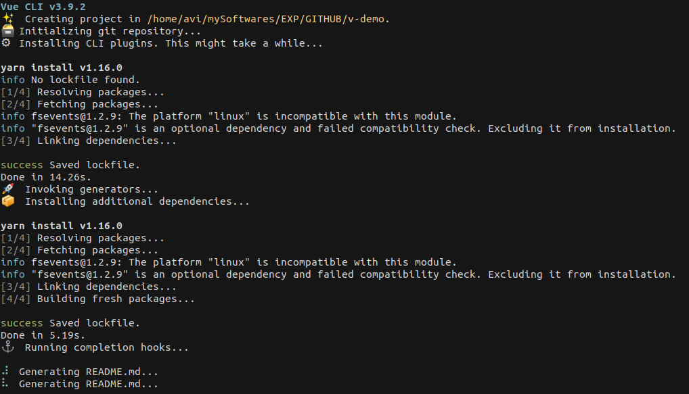

> web application are replacing older desktop applications. Why?

1. web apps are easy to update
2. unbound by device/platform
<!-- more -->


[ESlint](https://eslint.org/)
: The pluggable linting utility for JavaScript and JSX
* change single quotes to double quotes, remove/add simicolons

states
: data on which other data depends
Managing states in a mullti componenet applicaion could be difficult

Vuex
: State management pattern + Library
Wihout vuex pattern - communicating **events up** and **props down** to share data
vuex uses **reactive approach** when one component updates the state,
other components using the data are notified.

Axios
: Promise based HTTP client for the browser and node.js

firebase
: provides dynamic backend data store for web, android and ios
* database, authentication, storage (user images), hosting, functions and ML

vue.js
: declarative rendering and component composition.

## SPA-single page applications | MPA-multiple page application

#### PROS +

+ loads once in browser and then controlled by js for further use
  + *Eg:* Gmail, Google Maps, Facebook or GitHub.
+ Resourceful
  + resources (HTML, CSS and JS) are loaded once
  + later only DATA (json) is exchanged
+ easier to make Mobile applications as developer can reuse the same backend

#### CONS -

- SEO may not know about content which comes via AJAX calls
  - [`ref=canonical` links for SEOs](https://help.medium.com/hc/en-us/articles/217991468-About-SEO-and-duplicate-content)
- Securty concerns
  - more prone to XSS (cross site scripting) attacks

## VUE

1. Vue Instance
2. Attribute binding
3. Conditional rendering
4. List rendering
5. Event handling
6. class and style binding
7. computed properties
8. Components
9. Communication events
10. Forms
11. Tabs

* Declerative rendering
* Progressive web framework
  * progressive image loading
  * PWA by adding **manifest.json** and *service worker*
* **data binding** - Binds js objects to UI elements
  * 1-way data binding : js object => UI element `v-bind` oe `:` for short
    * binds data to *expression* - double moustache syntax
  * 2-way data binding : js object <=> UI element `v-model`
  * class binding
  * object binding
  * we can bind array of classes too
* URL Routing `vue-router` library
* Components `.vue`
  1. html template
  2. component scoped CSS
  3. component scoped JS
  4. `export default` - which would be imported into other components
  5. May also include GraphQL to fetch data like in *gatsby*
* components are binded together under `/layouts`
* conditionals `v-if`
* loops `v-for`
* User inputs `v-on:click=""`
* all DOM manipulations are handled by Vue
* DOM is a tree
  * component system branches complete page tree to small tree branches
  * Componenet need to be registered with vue
    * componenets properties `prop` are binded with data `v-bind`
* [Vue Life cycle diagram][2]
* Vue compiles the templates into <mark>Virtual DOM rendering</mark> functions[^3].
  * Combined with the **reactivity system**, Vue is able to intelligently figure out the minimal number of components to re-render and apply the minimal amount of DOM manipulations when the app state changes.
* `v-once` interpolation that do not change
* **computed** properties | **data** property
* *componenet* accepts a name and an object ~ Vue object
* component template is in **backticks** `` ` ``

* logic to code premium customer
  * newer options like free shipping for premium customers
* change product image on mouseover colours
* diable BUY button and in-stock if a product is out of stock
* Make a componet scope global - add it to main Vue object, like cart

> HTML can call components using props, how about when component need to update html DOM?

* component can `$emit` event and we attach a *event handler* as html attribute
* when event is captured DOM can trigger a method
* Nested components
* reset values after we submit the form
* save submitted form data into review object and send it to server only on checkout
* Form validations
* mounted is a lifecycle hook
* **vue bus** to transport objects from one part to another
* practise[^1]


## Vue Router

> What if we do not want to use `#` in URLs?

```js
router {
  mode: 'history';
}
```

* Install router
* add it to the application
* how to set up routes
* how to load these routes
* change model to have nicer URLs

+ `<router-link>` is handeled by js and not sent to server
  + doesnt sents a fresh request
+ URL parameters
+ Routes links to other navigation buttons and options, internal routing from code

## VueX - stage management store

* calling mutations dorectory is for synchronous events
* should you need asynchronous functionality use **actions**


## SPA at scale

* new ESX `import` syntax
  * js didn't have import/export for a long time
  * to future proof your js code
* Frameworks like angular, vue, react, Babel plugin helps address *cross browser compatibility*
  * scroll bar display on PC mac were off, causes virtualised scroll causes performance issues due to pixel deviation
* Does you application work on slow connections?
  * *webpagetest*
  * *lighthouse* chrome tool
* Documentation - **typescript** in code documentation

## Vue and Firebase application

* add firebase plugin to vue
* make firebase config object
* establish a connection using config object
* w3css works with vue

### Design systems

* Bootstrap
* Material Design
* [Vuetify](https://vuetifyjs.com/en/) leveraging componenet concept

vue Directives | Description
:---------:|:-----------
`v-app` | entrypoint


### To try

1. vue + firebase application
2. show reactivity happening live on browser

### Gridsome

1. Uses GraphQL layer to get data from different sources in order to dynamically generate pages from it
2. External Data --> GraphQL system --> Queries in application
   1. Plugin: faker to automatically generate data
   2. Grab data from external API
      1. JSONPlaceholder to get some dummy data
3. Insert your own data into graphQL using Data Source API


## VUE.JS tutorial

* Everything is encapsulated
* Babel - compile new js specification for older browser compatibility
* VUEX - website state management system
* npm install -g @vue/cli
* create new project
  * CLI way
    * vue test
  * GUI way
    * vue ui
* Components are embedded just like HTML tags
* `main.js` is the entrypoint of vue
* browser requests/loads index.html, which has `id='app'` and vue components enter through main.js into the webpage.
* **props** are exported to expose
* there has to be atleast one element inside `<Template>` tag
* `<style scoped>` css would affect only the local elements
* Javascript book on GitHub[^2]
* There may be data/utilities(axios) you’d like to use in many components - vue instance prototype property

el
: element

vue double moustache syntax
: {{ something }}

v-on
: listen to DOM event and event handling

vue directives
: are used to interact with DOM

> difference between *v-if* and *v-show*?

* css property display:none vs not being present in DOM at all
* So prefer v-show if you need to toggle something very often, and prefer v-if if the condition is unlikely to change at runtime.

* v-bind:/<html attribute/>
  * Dynamically add classes
    * Object syntax
    * js ternary syntax
* a component’s data option must be a function, so that each instance can maintain an independent copy of the returned data object when the component is reused
* Componenet must pe places BEFORE new Vue object is instantiated
* every component must have a single root elemen
* Component lifecycle functions
* inside components only required field to have is template
* vue **computed** properties are halfway between *data* and *methods*
* vueX - state management system
* vue has global store
* use short for project root directory `import cats from '@/data/cats'`
* actions -> mutations -> updates state
* that only kebab-case names are valid directly in the DOM (i.e. non-string templates).

> Sample applications you can make using vue or FSR?

1. quiz application
   1. questions pulled from API
   2. only user action for selection are computed
   3. red / green based on user choice
2. toDo list
3. Drill down Animals data


## Dashboards

* SVG + Front end rendering (VUE)
* data coming from browser, draw SVG, no graphing library required
* SVG rectangle powered by javascript to draw bar graphs
* `<g>` element in SVG is like `div` element in html
* random data generated to draw bar up/down effect
* ANimate things very nicely with vue
* Transitions -> CSS animations -> jS animations
* show and hide things based on conditions
  * style bindings
  * out-in - mostly
  * in-out
* Flip technique - causes least amount of repiants in browser than transitions
  * store and filter data animations
  * sudoku rearranges nummbers
* Reactive programming is programming with asynchronous data streams. stream is ongoing
* `<Watchers>` for reactive programming

{}

[difference between front end framework and templating language](https://stackoverflow.com/questions/25025317/what-is-the-conceptual-difference-between-angularjs-and-view-template-engines-in)

## Demo project

Use `npm` on linux else face the wrath of teminal error

{}
  vue create test --packageManager=npm
{}



still facing issues

```
$vue create v-demo --packageManager=npm

  vue create is a Vue CLI 3 only command and you are using Vue CLI 2.9.6.
  You may want to run the following to upgrade to Vue CLI 3:

npm uninstall -g vue-cli
npm install -g @vue/cli
```
{}
  Always check `htop` process manager as which process is stuck from process tree list
{}


### Footnotes

[^1]: [scrimba, vue tutorial](https://scrimba.com/g/gvuex)
[2]: https://vuejs.org/v2/guide/instance.html#Lifecycle-Diagram  "vuejs, lifecycle diagram"
[^3]: [Virtual DOM](https://www.accelebrate.com/blog/the-real-benefits-of-the-virtual-dom-in-react-js/)
[4]: [w3schools, filter search](https://www.w3schools.com/howto/howto_js_filter_lists.asp)
[5]: [gh, You-Dont-Know-JS](https://github.com/getify/You-Dont-Know-JS)