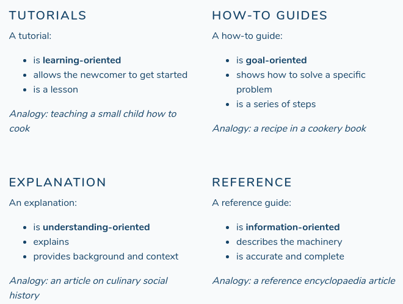

## Mender

* over-the-air software updates
* update manager supports both
  * application and 
  * system updates

### How to buid mender client into linux image

<!-- more -->

meta-mender[^1]
: is a yocto layer that can deploy image updates
* automatic roll-back
* remote management
* logging and reporting

meta-mender-core
: Cross-compiling Mender for ARM devices
* Partitioning the image correctly
* Setting up the U-Boot bootloader to support Mender

Gyroscopes
: measure orientation and angular velocity

udev - userspace /dev
: [is a device manager for the Linux kernel.](https://en.wikipedia.org/wiki/Udev)
* checks when new device is plugged in and makes it available as a FILE

udev rule to permanently change network interface name

# PCI device 0x14e4:0x164c (bnx2)
SUBSYSTEM=="net", ACTION=="add", DRIVERS=="?*", \
  ATTR{address}==[[["52:54:00:f1:93:3e"]]],           \
  ATTR{type}=="1", [[[NAME="enp2s0"]]]


1. MAC address of interface
2. New interface name
3. Skip using `Kernel`

Press <kbd>space</kbd> to interrupt bootloader

* clock is important
* bootloader choice
* powerloss at update, may make device unusable
* printenv, setenv, reset, boot
* watch where env var is written /etc/uboot something

---

## Open source projects business model

Business models for open-source software[^3]
: whose source code is publicly available under an open-source license to study, change, and improve its design.
* Examples Mozilla Firefox, Google Chromium, Android, LibreOffice and the VLC media player.
* Open-source software development has been a large part of the creation of the World Wide Web as we know it, with Tim Berners-Lee contributing his HTML code development as the original platform upon which the internet is now built.
* For example, most contributors to GCC or to the Linux kernel are professionals (and contributing about full time and paid for that). These projects are too complex to be worked on as a hobby.
* Bounty hunting programs[^2]

#### What do one need for testing?

1. test scripts, instructions
2. data and
3. documentation

[^4]

---

## VUE | React | Angular

+ vue has shorter learning curve than react
+ Dont have to deal with JSX transpilers
+ 2-way data binding
+ Templating - JSON data binding
+ Component structure with OOPs programming methodologies
  + builtin components
+ Progressive image loading like on medium (vue has that inbuilt)

gap to fill javascript fatigue

Client side rendering components

- routing
- templating
- JS syntax (like JSX)

All markdown files are compiled into Vue components and processed by webpack, therefore you can and should prefer referencing any asset using relative URLs:

Pages API is called after graphQL

Learning by examples.
- git@github.com:mazipan/gridsome-blog.git

#### How to have automatic cross-links and references in my documentaion and website?

sphinx has it

## PWA - progressive web app[^7]

1. A redirect from HTTP to HTTPS should be offered.
2. A serviceworker.js must be present.
3. A manifest.json must exist.

Dont have to write your own low level service worker APIs instead use something like
workbox[^8]



  <button [[[aria-label="close"]]]>x</button>
  <h2 [[[id="dialog-heading"]]]>Confirmation</h2>
  
Press Okay to confirm or Cancel

  <button>Okay</button>
  <button>Cancel</button>



1. The dialog is only announced as a dialog if it takes the `dialog` ARIA role
2. The `aria-labelledby` relationship attribute makes the element carrying the `id` it points to its label
3. The close button uses `aria-label` to provide the text label "close", overriding the text content
4. The heading is used as the dialog's label. The `aria-labelledby` attribute points to its `id`

- [gridsome](https://gridsome.org/)
- [vuepress](https://vuepress.vuejs.org/)

### Footnotes

[^1]: [building a mender yocto project image](https://docs.mender.io/2.0/artifacts/yocto-project/building)
[^2]: [issuehunt, get paid to solve open-source project issues](https://issuehunt.io/)
[^3]: [Business_models_for_open-source_software](https://en.wikipedia.org/wiki/Business_models_for_open-source_software)
[^4]: [What nobody tells you about documentation](https://www.divio.com/blog/documentation/)
[^7]: [turn a webapp into PWA in 10 mins](https://youtu.be/E8BeSSdIUW4)
[^8]: [google workbox](https://developers.google.com/web/tools/workbox/)