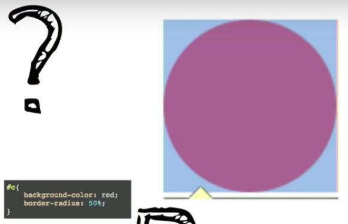
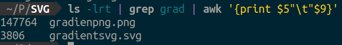

> Major operations to keep in mind while using design tools

1. Opacity and color gradient makes color come to life
2. Add extra detailing to main elements
   1. adding some small horizontal curved edges rectangles along the border
   2. use stroke
3. Grouping and duplicating elements
4. Moving elements to forground and background
5. Union, intersection operations to cut and grab required shape
6. quick scaling up and down
7. Start by looking the shape and questions what the closes shape it resembles to?
8. 

## Why bother about CSS?

* Its universal, every browser uses it to style webpages
* Responsiveness and supporting various devices, monitors, mobile phones, ultra wide screens
* Good design leads to good UX
* The <mark>BOX MODEL</mark> - everything is a box  
  * circle is rectangle box with 50% border radius
  * Big boxes are made up of smaller boxes
* Positioning
  * absolute - relative to its parent element

{}
    background image or color is displayed on content box, border box, padding box
    BUT NOT on the margin box. 
    Use **border-box** sizes most of the times to prevent confusion 
    `em` are cascading 
    `rem` are relative to root
{}

* PNG have transparetn background while JPEG do not
* SVG size is smaller than PNG 

## Most frequently used css properties

## Responsive design

* How many breakpoints and at what screen size
* 

### Footnotes

[^1]: [9 Important CSS Properties You Must Know](https://zellwk.com/blog/9-important-css-properties-you-must-know/)
[^2]: [yt, How to Design and Code a Responsive Illustration Style Website](https://www.youtube.com/watch?v=N2aqMIECY1Y)
[^3]: [yt, responsive designing](https://youtu.be/zszO7RioLb0)
