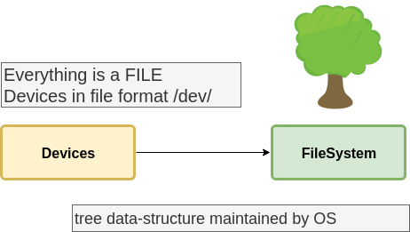

## Gitlab

* attach time-tracking info with merge requests and issues using `/estimated`, `/spend`[^1]
* inbuilt FREE to use CI, with stages overview visualization

## /etc/fstab mount



[External link to Read more on Filesystem ...](https://docs.google.com/document/d/e/2PACX-1vQY6TqYjKTnNEUWjS3Av0vboq-NhuZ04w7b5wVfHGzX_qF26a_FRTY3dD-RM-8y6bNPAGr8ZcVous63/pub) ::

* is a *system configuration files*
* Takes its name from `file-system tables`
* This file is used by the `mount` command[^2]


The disk names in Linux are alphabetical.
`/dev/sda` is the first hard drive (the primary master), `/dev/sdb` is the second etc.
The numbers refer to partitions, so /dev/sda1 is the first partition of the first drive.

Labels | Description
:-------:|:-------------------
hda   | stands for an PATA Hard-disk a
sda   | stands for an SCSI Hard-disk a + SATA + USBsda1 for example would mean the first partition of the scsi drive a
hda1  | first partition of ide drive aBoot Loader:
hd0   | Harddrive (not depending on the Hardware) id 0
hd0-1 | Harddive 0 partition 1

Device
: the first field specifies the mount device. These are usually device filenames. Most distributions now specify partitions by their labels or UUIDs.

Mount point
: the second field specifies the mount point, the directory where the partition or disk will be mounted. This should usually be an empty directory in another file system.

File system type
: the third field specifies the file system type.

Options
: the fourth field specifies the mount options. Most file systems support several mount options, which modify how the kernel treats the file system. You may specify multiple mount options, separated by commas.

Backup operation
: the fifth field contains a 1 if the dump utility should back up a partition or a 0 if it shouldn’t. If you never use the dump backup program, you can ignore this option.

File system check order
: the sixth field specifies the order in which fsck checks the device/partition for errors at boot time. A 0 means that fsck should not check a file system. Higher numbers represent the check order. The root partition should have a value of 1 , and all others that need to be checked should have a value of 2.

---

bootloader
: is a program that is found by the system BIOS in the **boot sector** (usually the first few sectors of storage device) of your storage device (hard drive’s Master boot record)
, and which locates and starts your operating system for you.

---

## Virtual Machine

> running virtual machine from commandline (like vagrant)[^4]

```sh
virsh list –all
virsh start <vm_name>
virsh shutdown <vm_name>
virsh destroy <vm_name>

virt-top    # might need installation
virsh dominfo <ID>
virsh console <ID>

virsh save
virsh reboot
virsh restore
```

{}
Use <kbd>CTRL + 5</kbd> to exit console
{}

### Footnotes

[^1]: [gitlab quick_actions](https://gitlab.pb.avantys.de/help/user/project/quick_actions.md)
[^2]: [etc-fstab-file](https://geek-university.com/linux/etc-fstab-file/)
[3]: [hotswapping with Automounter](https://en.wikipedia.org/wiki/Automounter)
[^4]: [starting KVM and how to console](https://ravada.readthedocs.io/en/latest/docs/config_console.html)
