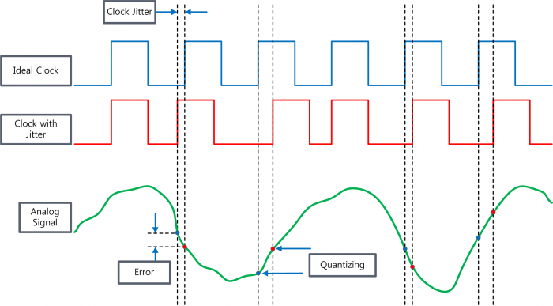
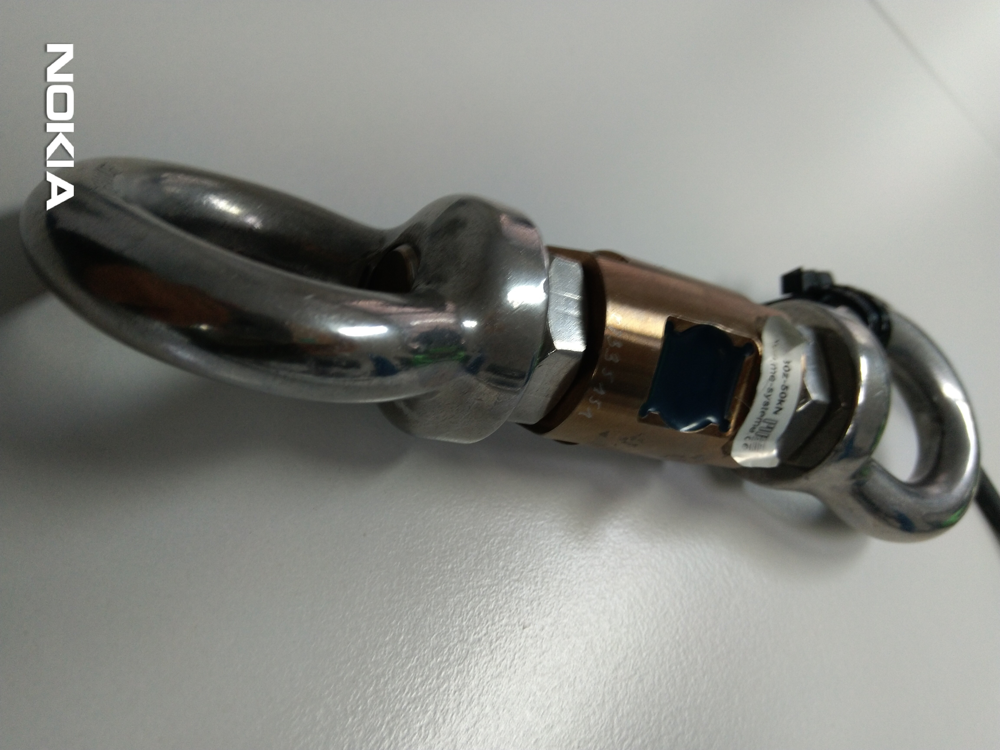

[ADC](https://en.wikipedia.org/wiki/Analog-to-digital_converter)
: sound picked up by a microphone or light entering a digital camera, into a digital signal
* Tensile force sensor
* Music players
* https://www.youtube.com/watch?v=Y2OPnrgb0pY
* Example https://www.ti.com/store/ti/en/p/product/?p=ADS1256IDBTG4
<!-- more -->

PGA
: programmable gain amplifier

Jitter
: In electronics and telecommunications, jitter is the deviation from true periodicity of a presumably periodic signal, often in relation to a reference clock signal. In clock recovery applications it is called timing jitter.
* Is it related/similar to phase?

Device | Driver
-------|----------
[ADS1256](http://www.ti.com/lit/ds/symlink/ads1255.pdf) | ADIS1256[^1]

## Tensile force Sensor

Tensile
: relating to tension

Tension
:  pulling force transmitted axially by the means of a string, a cable, chain, or similar one-dimensional continuous object, or by each end of a rod, truss member, or similar three-dimensional object;

### How to connect sensor to microcontroller?

> Once you've confirmed the Linux kernel supports your sensor you need to use the device tree 
> to configure and enable the sensor driver

* SPI pins are board (CPU) dependent
* Could be available as a seperate ADC chip or on a breakup board

1. Correct circuit diagram and schematics
   1. How to draw digital schematics? CAD design Tools
      1. LibrePCB
      2. Fritze
2. Search for sensor library
   1. **ads1256 arduino library**
   2. **ads1256 beaglebone library**

### CAD - Artistic PCB designing

1. Workspace editor
2. Schematics visualizer and editor

A hobby that you can use directly from home. Detecting poison in air[^2].

Make LED spaceships, butterflys, christmas trees

> Workflow on fusing Mechanical design couples with electrical design[^2]

1. Can we version control PCB designs?

## ADS1256 - datasheet

* `24-bit` analog-to-digital (A/D) converters
* There are three methods to reset the ADS1255/6: the
  * RESET input pin, 
    * When using the RESET pin, take it low to force a reset
  * RESET command,
  * and a special SCLK reset pattern.

### Footnotes

[^1]: http://www.ti.com/lit/ds/symlink/ads1255.pdf
[^2]: https://www.youtube.com/watch?v=FlynweLLpOY
