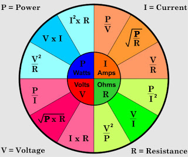

> How to make circuits, what we want them to do?

## Water Analogy

Voltage
: Pressure

Flow
: Current

<!-- more -->

Actuators
: produces motion

* Wirk app to create GUI and mobile apps for IOT

## Basic Electronics laws

1. Ohms Law
2. Kirchhoff's circuit laws
   1. Current entering a junction equals the current leaving the jkunction

## Capacitors

* Quick surge of charge, otherwise similar to battery[^1]
  * Flash bulbs, cameras, starter motor, audio amplifiers
* DIfferent from Battery as it Can Charge and DIscharge very quickly
* **SMOOTHING** AC current effect, else leds would be flickering
  * When polarity changes, capacitors discharge to provide power supply to circuit

## Components

* Heat Sink - remove heat from delicate componenets and increase their lifetime
  * Thermal Interface Material
    * No 2 metals will meet up perfectly
    * Fill in these micro gaps
* Resistors
  * Control i/p voltage for componenets like LEDs, capacitors etc. to avoid damage to circuit
  * Polarity doesnt matter
* Diods
  * Allows flow of current in one direction and not the other
  * `BC547`
  * POlarity matters
    * Forwars Bias
    * Reverse Bias
  * Breakdown mode
  * Protection Diod
    * PRevents accital damage to circuit when wrong polarity of power is applied
* Hookup wires
  * solid core wire
* Voltage Regulator
  * Takes in regulated voltage and spits out regulated constant voltage
  * New alternative - **Buck converter** or voltage step-down converter
* Switch Mode Power Supply
* Solderless Breadboards are not good for `RF` projects
* 

## How to analyze circuits?

* 

### Footnotes

[^1]: https://www.youtube.com/watch?v=5hFC9ugTGLs
[^2]: [3D printing online service](https://www.3dhubs.com/)
