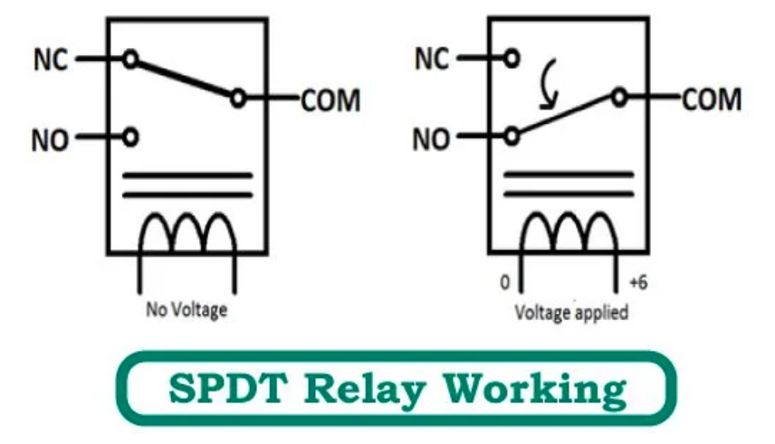

## NodeMCU - ESP8266

* Microcontroller
* `60MHz` with `64KB` memory, `96KB` data
* Asynchronous event-driven programming model
* Lua Flash Store (LFS) support
  * Lua is designed primarily for embedded use in applications
  * enables to create Lua applications with up to **256Kb** Lua code and read-only constants executing out of flash. All of the RAM is available for read-write data!
* Operating voltage `5V`
* Home Automation
* Version 2
* [Documentation](https://arduino-esp8266.readthedocs.io/en/latest/)
* [WiFi Library](https://arduino-esp8266.readthedocs.io/en/latest/esp8266wifi/readme.html)

## CODE

* 2 LEDs
  * `D0` inboard
  * `D4` on ESP board
* can have only 1 `main.cpp` file
*


Firmware
: provides the low-level control for the device's specific hardware. Firmware can either provide a standardized operating environment for the device's more complex software (allowing more hardware-independence), or, for less complex devices, act as the device's complete operating system, performing all control, monitoring and data manipulation functions. Typical examples of devices containing firmware are embedded systems, consumer appliances, computers, computer peripherals, and others. Almost all electronic devices beyond the simplest contain some firmware.

PWM
: Pulse Width Modulation

Relay
: electromagnetic switch, could be AC/DC
* 3 terminals on output side
* **NO** - Normally opened
* **COM** - common
* **NC** Normally Closed - mostly shorted
* Energizing coil with power supply
* [How does a rely work?](https://www.youtube.com/watch?v=clV_HtQenOk)
* Reduce short hazard

> How to identify relay terminal when not marked on device?

Use Multimeter

* `COM` and `NC` are connected, you will get continuity
* `COM` and `NO` are close, no continuity



RTS (Request to Send) and CTS (Clear to Send)

## Getting started

1. Flash the Image - `esptools.py`
2. `sudo apt install python-serial`
3. Image / Firmware
   1. `./esptool.py --port /dev/ttyUSB0 image_info ../nodemcu-master-15-modules-2019-09-13-20-57-17-integer.bin`
   2. `sudo ./esptool.py --port /dev/ttyUSB0 write_flash 0x00000 ../nodemcu-master-15-modules-2019-09-13-20-57-17-integer.bin`
4. [Uploading code to module](https://frightanic.com/iot/tools-ides-nodemcu/)
   1. Configure Arduino IDE `NodeMCU1.0(ESP-12E-module)`
   2. [Platform.io](https://platformio.org/) in vsCode

> Microcontroller vs Microprocessor

* Microcontroller is more specifc, Microprocessor is more general in use

```sh
# is serival device connected
ls /sys/class/tty/ttyUSB*

```

> What is SERIAL port?[^1]

## IoT Projects structure

1. Logic Schematics
2. Setting up the HArdware Rig
3. Softwares part
   1. Choose/build Firmware/OS
   2. Write Application Software

## Modules

* [WiFi Manager](https://github.com/tzapu/WiFiManager)
  * when your ESP starts up, it sets it up in Station mode and tries to connect to a previously saved Access Point
  * if this is unsuccessful (or no previous network saved) it moves the ESP into Access Point mode and spins up a DNS and WebServer (default ip 192.168.4.1)
  *

## PIO Testing

* Each test is a small independent program/firmware with its own `main()`, `setup()` or `loop()` functions.
* Test should start with `UNITY_BEGIN()` and finish with `UNITY_END()` calls.

## Control a CFL from internet

> Controlling high voltage part from low voltage

* Operating voltage of CFL is `230V` and node is `5V`
* Use Relay to act as a mediator b/w bulb and board
  * Can turn ON/OFF using a pulse from microcontroler
* Scan WiFis
* Connect to a WiFi
* Print IP to connect to nodeMCU from network
* Host a simple HTTP server in nodeMCU

## Transformer


### Footnotes

[^1]: https://www.youtube.com/watch?v=myU2x27FIIc
[^2]: https://github.com/spacehuhn/esp8266_deauther
[^3] : https://github.com/nodemcu/nodemcu-devkit-v1.0/blob/master/NODEMCU_DEVKIT_V1.0.PDF
