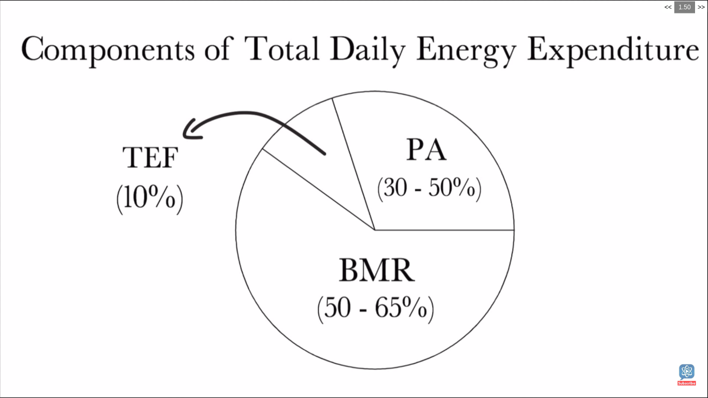

---
categories:
- foods
- nutrition
- facts
- anatomy
- resources
comments: false
date: "2019-05-30T22:58:06+02:00"
lastmod: "2019-05-30T22:58:06+02:00"
tags:
- plant based
thumbnail: https://www.bbcgoodfood.com/sites/default/files/editor_files/2017/11/plant-based-diet-guide-main-image-700-350.jpg
title: Calories
type: post
w3codecolor: true
---

## what are calories?
The [*calorie*](https://en.wikipedia.org/wiki/Calorie) is a unit of energy.


Amount of energy it would take to raise the temperature of 1 kg of water by
one degree Celcius.
</br></br>
Everything we consume has a calorie count, a measure of how much energy the
item stores in its chemical bonds. 


Because energy is defined via work, the SI unit for energy is the same as the unit of work – the joule (J), named in honor of James Prescott Joule and his experiments on the mechanical equivalent of heat. In slightly more fundamental terms, 1 joule is equal to 1 newton metre and, in terms of SI base units.

### Types of calories

1. Calories (with capital C) - nutritional calories
2. calories (with small c)

```
1 Calorie = 1,000 calories
          = 4,184 Joules

1 Pound = 3,500 Calories
```

> Calories IN/OUT | effect
> ---------------|-----------
> Calories IN *==* Calories out | remain **same**
> Calories IN *>* Calories out | **gain** weight
> Calories IN *<* Calories out | **loose** weight


## How many calories do I really need?

`2000` for women and `2500` for men. Based on factorrs like

* Average weight
* Physical activity
* Muscle mass

### `TDEE` Total Daily Energy Expenditure

* *BMR* Basal Metabolic Rate
   Calories your body needs just to keep you alive.
* *TEF* Thermal Effect Of Food
* *PA* Physical Activity
     
> 
> `TDEE = BMR + TEF + PA`
> 
> ### How do we calculate BMR?
> 
> #### Mifflin-St Jeor Equation
> ```
> BMR = (10 * Weight[Kg]) + (6.25 * height[cms]) + (5 * age[years]) + S
> S = 5 for men
> S = -161 for women
> ```



## How to choose a diet for yourself?

There is not perfect diet for human. As metabolism depends on *gut bacteria*
in our intestines.

> https://genie.weizmann.ac.il/

Use a *glucose* measuring device

### Apps to measure calorie intake

* myFitnessPal
* Lose it
* 