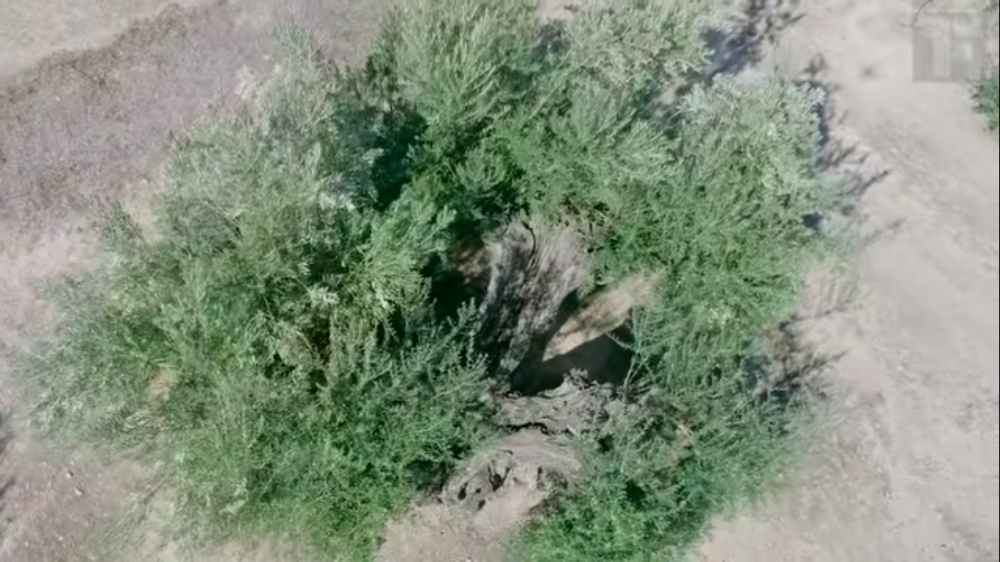

## How Olive oil is made?

> Spain the the worlds largest olive oil producer

Medeterranian countries are the largest producers of olive oil in the world.

* Oil is Cold pressed using hydraulic press
  * Called **extra virgin olive oil** when no chemicals are added at cold press
* Olive tree can survive in extreme condition, even after burning like a phoenix
  * Can potentially live upto 6,000 years, like trees in lebanon
* More than 700 varieties of olives
* Heat is the enmy of the flavor
* Making olive oil is a race against time
  * Have to react the production plant under 3 hrs from when its picked from tree

> **10 Kgs** of olives only give **1 L** olive oil

Cold press
:   Maintaining a temperature of **40C** is no easy task

Why corns have corn silk inside?
:   Basically they are corns private parts. Chastity belt. Pollen travels down the silk to the ear and voila, pollination.

### Steps

1. Milling
2. Centriguges to seperate oil from pummes

<iframe width="560" height="315" src="https://www.youtube.com/embed/QCKUpFMmKJw" frameborder="0" allow="accelerometer; autoplay; clipboard-write; encrypted-media; gyroscope; picture-in-picture" allowfullscreen></iframe>

<iframe width="560" height="315" src="https://www.youtube.com/embed/dnzSoMqOWDY" frameborder="0" allow="accelerometer; autoplay; clipboard-write; encrypted-media; gyroscope; picture-in-picture" allowfullscreen></iframe>

## Resources

* https://www.youtube.com/channel/UCOaof-3dr6b7dFIxNP_1Wlw