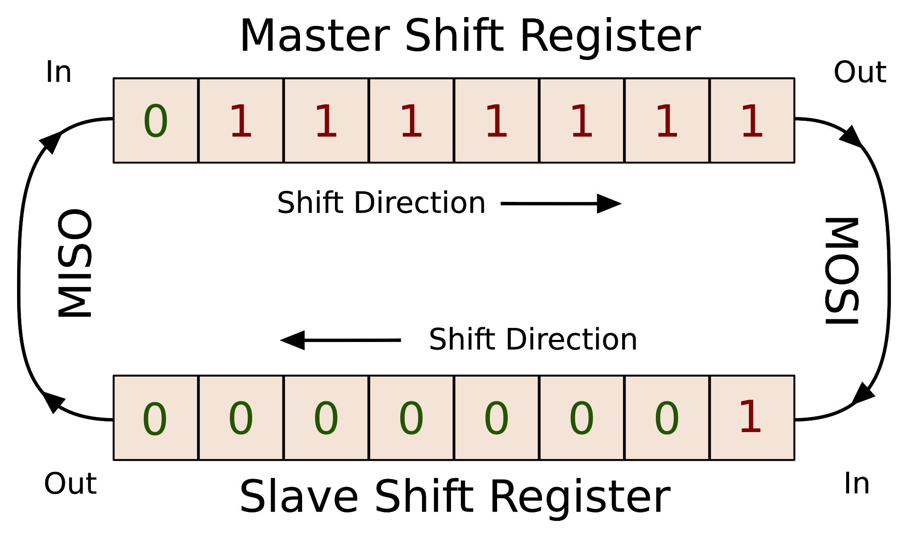

LVDS
:  Low Voltage Differential Signaling

Differential Signaling
: The technique sends the same electrical signal as a differential
pair of signals, each in its own conductor.
The receiving circuit responds to the electrical difference between
the two signals, rather than the difference between a single wire and ground

transceiver
: a device that can both transmit and receive communications, in particular a combined radio transmitter and receiver.

Polarity
: signal’s position or voltage above or below the median line

Phase
:  Phase is delay and results in the offsetting of a signal in time.
It follows that a 180° phase shift is a half-rotation or half-wavelength and a 360° phase shift is a whole rotation or full wavelength.

CS
: [chip select](https://en.wikipedia.org/wiki/Chip_select)
For arduino its not restricted to `D10`, we can configure any pin on board as salve select line or chip select.

Bitrate
: In digital telecommunication, the bit rate is the number of bits that pass a given point in a telecommunication network in a given amount of time, usually a second. Kbps


$$ Bit Rate = \frac{Data}{Time} $$

```
Where:
    BR = Bit Rate
    D = Amount of Data
    T = Time (usually seconds)
```

GPIO expanders
: for GPIO pins to connect multiple i2c devices when the number of available on board pins are less

A push–pull amplifier
: is a type of electronic circuit that uses a pair of active devices that alternately supply current to, or absorb current from, a connected load

stty
: set tty

```
stty istrip
stty -a | grep -i istrip
stty -istrip
stty -a | grep -i istrip
```

UART
: Universal asynchronous reciever transmitter


* There are two basic types of serial interfaces: synchronous and asynchronous.
* Synchronous interfaces have the data transmitted with its timing relative to an explicit clock, which is also provided. The classic example of this is SPI
* Asynchronous interfaces have the timing encoded in the data stream itself. For "serial ports" and related standards such as RS232
* Most Significant Bit (MSb) or the Least Significant Bit (LSb)

device
: a physical device that is attached to a bus

driver
: a software entity that can be associated with a device and performs operations with it

bus
: a device to which other devices can be attached

class
: a type of device that has a similar behavior; There is a class for discs, partitions, serial ports, etc.

subsystem
: a view on the structure of the system; Kernel subsystems include devices (hierarchical view of all devices in the system), buses (bus view of devices according to how they are attached to buses), classes, etc.

## SPI



* synchronous, serial communication interface
* Short-distance communication in embedded systems
* Full duplex mode
* SPI is one master and multi slave communication
* Motorolla in 1980s
* SPI maximum speed, It is in fact capable of `80MHz`.
* Multiple salves are supported using `SS` **Slave select** or `CS` **chip select**
* Transmissions normally involve two **shift registers** of some given word-size, such as eight bits, one in the master and one in the slave; they are connected in a virtual ring topology
* Independent slave configuration | Daisy chain configuration
* The SS line is normally held high, which disconnects the slave from the SPI bus. (This type of logic is known as **active low**
* Because of the high speed signals, SPI should only be used to send data over short distances (up to a few feet). If you need to send data further than that, lower the clock speed, and consider using specialized driver chips.

When the chip select pin is held in the inactive state, the chip or device is "deaf", and pays no heed to changes in the state of its other input pins; it holds its outputs in the high impedance state, so other chips can drive those signals. When the chip select pin is held in the active state, the chip or device assumes that any input changes it "hears" are meant for it, and responds as if it is the only chip on the bus. Because the other chips have their chip select pins in the inactive state, their outputs are high impedance, allowing the single selected chip to drive its outputs.[5]

CS may also affect a power consumption or serve as cycle control in certain circuits (such as SRAM or DRAM) 

### Pros and CONS

* Slaves do not need a unique address – unlike I²C or GPIB or SCSI
* Not limited to 8-bit words
* SPI does not support hot swapping (dynamically adding nodes)

SPI Mode |	CPOL   | CPHA	| Clock Polarity in Idle State | Clock Phase Used to Sample and/or Shift the Data
----------|--------|--------|------------------------------|-----------------------------------------------------------
0	      | 0	   | 0	    | Logic low	                   | Data sampled on the rising edge and shifted out on the falling edge
1	      | 0	   | 1	    | Logic low	                   | Data sampled on the falling edge and shifted out on the rising edge
2	      | 1	   | 1	    | Logic high	               | Data sampled on the falling edge and shifted out on the rising edge
3	      | 1	   | 0	    | Logic high	               | Data sampled on the rising edge and shifted out on the falling edge

- Device talk to persistent storage in the form of an EEPROM over the Serial Peripheral Interface Bus (SPI) on the BeagleBone Black.
  SPI signals over longer distance on the
  same PCB or off PCB to another board in a noisy
  environment by transmitting SPI signals over LVDS
  interface
  - LVDS devices offer more noise immunity
  - could be implemented as board to board application or single board application
- At least 3 meter communication range using SPI
  over LVDS vs. 0.5 meter range using standard SPI
- As distance increases, external noise and crosstalk between SPI
  signals becomes an issue
- The SPI allows data to move in both directions from a bus master (controller) to various chips which are attached to the bus
- Application
  - ADCs, DACs, shift registers, SRAM
-  SPI devices support much higher clock frequencies compared to I2C interfaces.
-  select the slave by enabling the CS signal. Usually chip select is an active low signal.
-  One chip select CS line for each slave device. Could not use for as many as with i2c due to this limitation
-  High speed like writing to SD card

### SPI application

* Semiconductor Test Equipment
* Data Acquisition
* Lab Instrumentation
* Ultrasound Scanner
* CT Scanner
* Protection Relay
* Terminal Unit

### SPIDEV Driver

```
spidev_test --device /dev/spidev0.0 --verbose -p 'MESSGAE' --speed 250000

# SPI-MODE 0X4
spidev_test --device /dev/spidev0.0 --verbose -p 'MESSGAE' --cs-high

```

## CAN

- the transmission rate is specified in Bits/Sec not Hz.
- developed by Bosch starting in 1983
- Multi master network
- Bit rate upto 1 Mbits/sec
- Network length upto **5Km**
- serial communication protocol

### CAN Frames

#### How to set CAN bitrate?

{}
  ip link set can0 type can bitrate 12500
{}

## GPIO -  General Purpose Input Output

* They are General Purpose Input Output and are pins on various processors that aren’t dedicated to anything.

As a recap, each gpio pin on the BBB has <mark>three different numbering</mark> schemes associated with it!

1. The physical pin location, in the form of `PX_Y (P8_28)`
2. The gpio name, in the form of `GPIOX_Y (GPIO2_24)`
3. The gpio number, in the form of $$32*X + Y (88)$$

{}
Only the last scheme, the gpio number, is used in software!
{}


# Bus Protocols

Buses provides a communication path between peripheral devices and enable data transfer.

## I2C - Inter Integrated Circuit

I2C is a bidirections, two-wired, serial bus that is suitable for applications requiring
occasional communication over a *short distance* between many devices.
The I2C bus supports 7-bit and 10-bit address space device and has 2 signal lines

SDA
: Serial Data Line, driven either by master or peripheral device

SCL
: Serial Clock Line, driven by master

slaves
: are other peripheral devices such as ADC (Analog to Digital Conversion), EEPROM, DAC (Digital to Analog converter)
wherein each slave consists of a unique address

### Data transfer speed

1. standard 0Hz to 100Hz
2. fast-mode 0Hz to 400 KHz and
3. high-speed-mode 10 KHz to 100KHz.

### Testing i2c bus using on device

I2C Basic Commands Sequence

- transfer data to slave devices
- Master to slave Write operation, write data to slave
- Read Operation Slave to Master

i2c-tool Command	Description

| i2c-tool command          | Description             |
|--------------------------:|:------------------------|
| i2cdetect                 | bus scanning            |
| i2cdump                   | examine I2C registers   |
| i2cget                    | Device register reading |
| i2cset                    | set I2C registers       |


#### How to list all i2c buses available on device?

Lists all the available buses configured on device

```
    root@beaglebone-yocto:~# i2cdetect -l
    i2c-1	i2c       	OMAP I2C adapter                	I2C adapter
    i2c-0	i2c       	OMAP I2C adapter                	I2C adapter
```


Detect devices connected to i2c bus

```
    root@beaglebone-yocto:~# i2cdetect -y 0
    Warning: Can't use SMBus Quick Write command, will skip some addresses
        0  1  2  3  4  5  6  7  8  9  a  b  c  d  e  f
    00:                                                 
    10:                                                 
    20:                                                 
    30: -- -- -- -- 34 -- -- --                         
    40:                                                 
    50: 50 -- -- -- -- -- -- -- -- -- -- -- -- -- -- -- 
    60:                                                 
    70:                                                 
```

{}
the ones showing **UU** denote this address is currently in use by a driver,
while devices without a registered driver show the address (in the example 0x60).
{}

#### How to reading from slave registers?

Read and dump everythig from slave registers to stdout

```
    root@beaglebone-yocto:~# i2cdump -y 0 0x34
    No size specified (using byte-data access)
        0  1  2  3  4  5  6  7  8  9  a  b  c  d  e  f    0123456789abcdef
    00: 12 12 12 12 12 12 12 12 12 12 12 12 12 12 12 12    ????????????????
    10: 12 12 12 12 12 12 12 12 12 12 12 12 12 12 12 12    ????????????????
    20: 12 12 12 12 12 12 12 12 12 12 12 12 12 12 12 12    ????????????????
    30: 12 12 12 12 12 12 12 12 12 12 12 12 12 12 12 12    ????????????????
    40: 12 12 12 12 12 12 12 12 12 12 12 12 12 12 12 12    ????????????????
    50: 12 12 12 12 12 12 12 12 12 12 12 12 12 12 12 12    ????????????????
    60: 12 12 12 12 12 12 12 12 12 12 12 12 12 12 12 12    ????????????????
    70: 12 12 12 12 12 12 12 12 12 12 12 12 12 12 12 12    ????????????????
    80: 12 12 12 12 12 12 12 12 12 12 12 12 12 12 12 12    ????????????????
    90: 12 12 12 12 12 12 12 12 12 12 12 12 12 12 12 12    ????????????????
    a0: 12 12 12 12 12 12 12 12 12 12 12 12 12 12 12 12    ????????????????
    b0: 12 12 12 12 12 12 12 12 12 12 12 12 12 12 12 12    ????????????????
    c0: 12 12 12 12 12 12 12 12 12 12 12 12 12 12 12 12    ????????????????
    d0: 12 12 12 12 12 12 12 12 12 12 12 12 12 12 12 12    ????????????????
    e0: 12 12 12 12 12 12 12 12 12 12 12 12 01 00 00 4a    ?????????????..J
    f0: 2e 00 00 fc ca 81 10 ff 00 00 00 82 00 00 00 06    ...????....?...?
```

#### How to set and read from individual slave register

```sh
i2cset
i2cget
```

## SPI - Serial Peripheral Interface[^1]

* Beagle bone hase 2 SPI buses available.
* Has better range than i2c

**SPI-0** is configured and available on device along with **spidev_test** utility.

## Developing or Troubleshooting the SPI bus?

Using a [Logic Analyser](https://en.wikipedia.org/wiki/Logic_analyzer) to measure current flow.
Most logic analyzers have the capability to decode bus signals into high-level protocol data and show ASCII data.

* is only for Logic (0|1) measurements
* Mode of operations
  * Timing Analysis mode
  * State Analysis mode
* Sequential Sampling
* COmpresssion Sampling

1. Configure kernel modules

```
CONFIG_SPI=y
CONFIG_SPI_MASTER=y
CONFIG_SPI_OMAP24XX=y
CONFIG_MTD_SST25L=y
CONFIG_SPI_SPIDEV=y
```

2. Configuring your device-tree (mainline)

```
&am33xx_pinmux {
	pinctrl-0 = <&gpio_pins>;

      spi0_pins_default: spi0_pins_default {
		pinctrl-single,pins = <
			AM33XX_IOPAD(0x950, PIN_INPUT_PULLUP | MUX_MODE0) /* P9_22 (A17) spi0_sclk.spi0_sclk */
			AM33XX_IOPAD(0x954, PIN_INPUT_PULLUP | MUX_MODE0) /* P9_21 (B17) spi0_d0.spi0_d0 */
			AM33XX_IOPAD(0x958, PIN_INPUT_PULLUP | MUX_MODE0) /* P9_18 (B16) spi0_d1.spi0_d1 */
			AM33XX_IOPAD(0x95c, PIN_INPUT_PULLUP | MUX_MODE0) /* P9_17 (A16) spi0_cs0.spi0_cs0 */	
			#if 0
				AM33XX_IOPAD(0x960, PIN_INPUT_PULLUP | MUX_MODE0) /* (C15) spi0_cs1.spi0_cs1 */
			#endif
		>;
	};
};

&spi0 {
    pinctrl-names = "default";
	pinctrl-0 = <&spi0_pins_default>;
	status = "okay";
	
	spidev@0 {
		compatible = "spidev";
		spi-max-frequency = <48000000>;
		reg = <0>;
		spi-cpha;
	};
};

```

## How to testing SPI using spidev_test utility?

On the slave, run:

```
root@beaglebone-yocto:~# spidev_test --device /dev/spidev0.0 --verbose
spi mode: 0x0
bits per word: 8
max speed: 500000 Hz (500 KHz)
TX | FF FF FF FF FF FF 40 00 00 00 00 95 FF FF FF FF FF FF FF FF FF FF FF FF FF FF FF FF FF FF F0 0D  | ......@....�..................�.
RX | FF FF FF FF FF FF FF FF FF FF FF FF FF FF FF FF FF FF FF FF FF FF FF FF FF FF FF FF FF FF FF FF  | ................................
```

> spi mode = Clock polarity (CPOL) `--cpol` X Clock Phase (CPHS) `--cpha`


On the master (another device, another SPI port, or an SPI analyzer) send a similar message "MASTER_HELLO_TO_SLAVE".
Note that it must send the exact number of bytes the slave expects.
If the master is another Linux device or port, you can use the spidev_test application as well:

`-p`
: Send data (e.g. "1234\xde\xad")

```
    $ spidev_test -D /dev/spidev0.0 -p "SLAVE_HELLO_TO_MASTER" -v
    The slave is now blocked waiting to receive clocks from the master, to shift out the message.

    $ spidev_test -D /dev/spidev0.0 -p "MASTER_HELLO_TO_SLAVE" -v
    If it is an analyzer, you may send the message "MASTER_HELLO_TO_SLAVE" in hexadecimal:

    4D 41 53 54 45 52 5F 48 45 4C 4C 4F 5F 54 4F 5F 53 4C 41 56 45
```

## Test with ossilator? Waveform


## CAN - Controller Area Network

can is a serial connection protocol which allows communication without a host computer.
BeagleBoneBlack has two internal CAN-Bus controller which are called **DCAN0** and **DCAN1**

**can0** is configured on device alongwith **canutils**

The pins of the DCAN0-interface are multiplexed to the connector as per table below


#### How to testing CAN using canutils?

**Cansend** is used to transmit individual frames directly onto the CANbus and **candump** to read the frames.

```
$ cansend can0 5A1#11.22.33.44.55.66.77.88
$ cansend can0 -i 0x123 0xaa 0xbb 0xcc 0xdd
$ cat /proc/net/can/stats 

    2 transmitted frames (TXF)
    2 received frames (RXF)
    0 matched frames (RXMF)

    0 % total match ratio (RXMR)
    0 frames/s total tx rate (TXR)
    0 frames/s total rx rate (RXR)

    0 % current match ratio (CRXMR)
    0 frames/s current tx rate (CTXR)
    0 frames/s current rx rate (CRXR)

    0 % max match ratio (MRXMR)
    1 frames/s max tx rate (MTXR)
    2 frames/s max rx rate (MRXR)

    0 current receive list entries (CRCV)
    1 maximum receive list entries (MRCV)

    1 statistic resets (STR)


$ candump can0
can0 5A1 [8] 11 22 33 44 55 66 77 88
```

By default **canplayer** will replay a logfile back onto the interface recorded in the log file.

```
    $ canplayer -I candump-2017-05-19_101301.log
    Using the log file below

    $ cat candump-2019-05-19_101301.log
    (1495188791.945939) can0 0DF805A0#002B87A93FFCEDC4
    (1495188791.945961) can0 0DF805A0#012800586711CFDB
    (1495188791.945970) can0 0DF805A0#02490800F41547C4
    (1495188791.945979) can0 0DF805A0#03D26E0380662300
    Will produce

    $ candump can0
    vcan1 0DF805A0 [8] 00 2B 87 A9 3F FC ED C4
    vcan1 0DF805A0 [8] 01 28 00 58 67 11 CF DB
    vcan1 0DF805A0 [8] 02 49 08 00 F4 15 47 C4
    vcan1 0DF805A0 [8] 03 D2 6E 03 80 66 23 00
```

It is possible to tell canplayer to play messages recorded on one interface back on another interface.

```
    $ canplayer -I candump-2017-05-19_101301.log can0=vcan1
    will play messages recorded on vcan1 on can0 interface to produce

    $ candump can0
    can0 0DF805A0 [8] 00 2B 87 A9 3F FC ED C4
    can0 0DF805A0 [8] 01 28 00 58 67 11 CF DB
    can0 0DF805A0 [8] 02 49 08 00 F4 15 47 C4
    can0 0DF805A0 [8] 03 D2 6E 03 80 66 23 00
```

## Quesetions

1. spi vs i2c vs uart, whats the difference?
2. https://electronics.stackexchange.com/questions/37814/usart-uart-rs232-usb-spi-i2c-ttl-etc-what-are-all-of-these-and-how-do-th
3. https://linux-kernel-labs.github.io/master/labs/device_model.html
4. https://www.rfwireless-world.com/Terminology/UART-vs-SPI-vs-I2C.html
5. https://www.allaboutcircuits.com/technical-articles/spi-serial-peripheral-interface/

### Footnotes

[^1]: [spi tutorial](https://www.corelis.com/education/tutorials/spi-tutorial/)
[^2]: [SPI architecture user guide, TI](http://www.ti.com/lit/ug/sprugp2a/sprugp2a.pdf)
[^3]: [stackoverflow, spi on beaglebone back](https://stackoverflow.com/search?q=%5Bbeagleboneblack%5D+spi)
[^4]: [youtube, How to use SPI, basic electronics](https://youtu.be/fvOAbDMzoks)
[^5]: [BBB gpio pins numbering](https://vadl.github.io/beagleboneblack/2016/07/29/setting-up-bbb-gpio)
