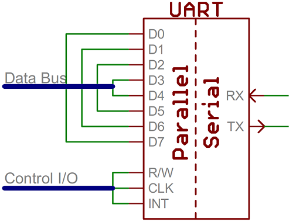
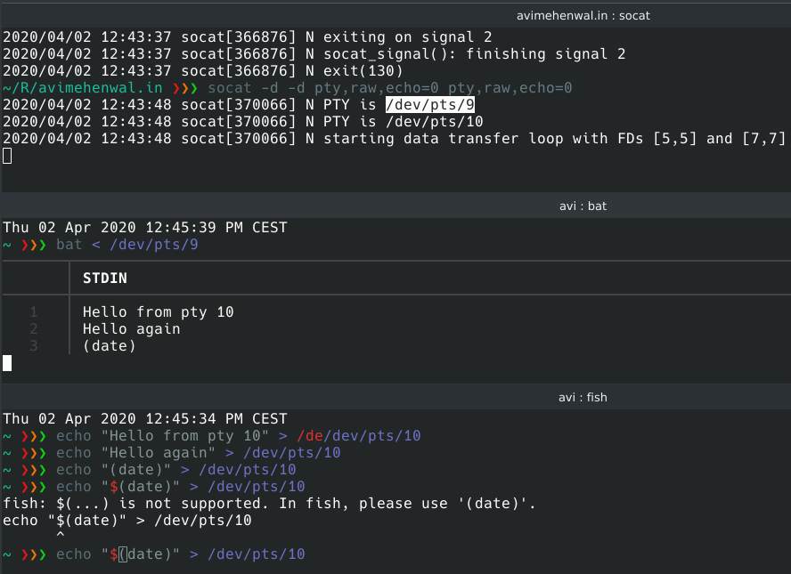

Serial Communication
: In telecommunication and data transmission, serial communication is the process of sending data one bit at a time, sequentially, over a communication channel or computer bus. This is in contrast to parallel communication, where several bits are sent as a whole, on a link with several parallel channels.
* + Data bits,
* + Synchronization bits- Frame start/end
* + Parity bits- odd/even
* + Baud rate -  how fast data is sent over a serial line **bps**

---

{}
For every byte of data transmitted, there are actually 10 bits being sent: a start bit, 8 data bits, and a stop bit. So, at 9600 bps, we're actually sending 9600 bits per second or 960 (9600/10) bytes per second.
{}

* [Can system boot without Video Card?](https://superuser.com/questions/454972/does-a-modern-pc-require-a-graphics-card-to-run)
  * Linux can be configured to run headless, that is, without a video console + keyboard; the console is assigned to a serial port.
  * Depends on Motherboard and BIOS
* How to identify Serial port?
  * Port 1 - in most cases[^1]
  * USB-Serial adapter to connect to modern laptop - `ttyUSB0` in most cases
    * dmesg
  * Most of the times, linux already will have serial device driver installed
* Tools to connect
  * Picocom
  * Minicon
  * SSH connection
* Methods to connect to a IoT device like RPi?
  * HDMI port with USB keyboard
  * via Networking using SSH
  * Serial Port (if device has one)- using UARTS RX and TX
    * [How to make one?](https://www.youtube.com/watch?v=ZRKBlGvsxMw)
    * Small arduino device relaying RX, TX traffic to USB port connected to computers
    * You need 2 UART interfaces
* to connect to a IoT device using serial connect all we need is
  * [ ] targe device with 1 UART interface enabled
  * [ ] Intermediate device to forward UART traffic via USB to a laptop, How to cpnfigure it
  * [ ] Laptop equipped with putty/picocom, to read forwarded UART traffic

## Serial communication in Linux

* Most of the times Linux already has serial device drivers installed
* In Linux, **COM1** is `ttyS0`, **COM2** is `ttyS1`
* Pesudoterminals[^3]
  * to feed text input to the master pseudo-device for use by the shell (such as bash), which is connected to the slave pseudo-device,
  * to read text output from the master pseudo-device and show it to the user.


[[[dmesg]]] | grep tty
demsg | grep pty
[[[setserial]]] -g /dev/ttyS[0123]
socat -d -d [[[pty]]],raw,echo=0 pty,raw,echo=0

cat [[[/proc/tty/driver/serial]]]
serinfo:1.0 driver revision:
0: uart:16550A port:000003F8 irq:4 tx:0 rx:0
1: [[[uart:16550A]]] port:000002F8 irq:3 tx:111780 rx:1321 RTS|DTR|DSR
2: [[[uart:unknown]]] port:000003E8 irq:4
3: uart:unknown port:000002E8 irq:3

# Linux commands
[[[w]]]
who
who am i
ls -la /dev/pts
tty
cat /sys/class/tty/tty0/[[[active]]]


1. check is any serial device is detected by OS or not?
2. Program to connect to serial device. Could be `minicom`, `picocom`, `putty` as well
3. Create a virtual TTY using `socat` program
4. How do I know how manyc and which UARTs are connected?
5. Connected/ used by a device
6. Free and available
7. List all TTYs and PTS used on linux machine
8. Active TTY

* Proxy serial over TCP with socat
* Advantages of serial console vs normal console[^2]
* Serial ports, also called communication (COM) ports, are bi-directional.
* Serial devices use different pins to receive and transmit data - full-duplex mode
* Serial ports rely on a special controller chip, the Universal Asynchronous Receiver/Transmitter (UART), to function properly.
* The UART chip takes the parallel output of the computer's system bus and transforms it into serial form for transmission through the serial port. In order to function faster, most UART chips have a built-in buffer of anywhere from 16 to 64 kilobytes.
* While most standard serial ports have a maximum transfer rate of 115 Kbps (kilobits per second), high speed serial ports, such as Enhanced Serial Port (ESP) and Super Enhanced Serial Port (Super ESP), can reach data transfer rates of 460 Kbps.
* The critical part is making sure that both devices on a serial bus are configured to use the exact same protocols on both seder and reciever.
* The final piece to this serial puzzle is finding something to both create the serial packets and control those physical hardware lines. Enter the **UART**.
  * UARTs do exist as stand-alone ICs,
  * Also possible to have softwared UARTS
  * If a microcontroller doesn't have a UART (or doesn't have enough), the serial interface can be bit-banged - directly controlled by the processor. This is the approach Arduino libraries like SoftwareSerial take. Bit-banging is processor-intensive, and not usually as precise as a UART, but it works in a pinch!

{}
* Serial Port
  * What is Serial communication?
  * Serial ports versus parallel ports?
  * Serial communication Standards? **RS-232**
  * Virtual Serial communication/port?
  * serial port, USB port, parallel port
{}

## Virtual serial port

* This port is created by software which enable extra serial ports in an operating system without additional hardware installation (such as expansion cards, etc.).
* Virtual serial ports emulate all hardware serial port functionality, including baud rate, data bits, parity bits, stop bits, etc. Additionally, they allow controlling the data flow, emulating all signal lines (DTR, DSR, CTS, RTS, DCD, and RI) and customizing pinout. Virtual serial ports are common with Bluetooth and are the standard way of receiving data from Bluetooth-equipped GPS modules.
* How to make virtual serial port in linux?
  * `socat -d -d pty,raw,echo=0 pty,raw,echo=0`
  * 

## Examples

* https://www.macstadium.com/
  * enterprise-class cloud solutions for Mac and iOS app development

### Footnotes

[^1]: https://www.youtube.com/watch?v=2DyZybdXvwE
[^2]: https://www.tldp.org/HOWTO/Remote-Serial-Console-HOWTO/intro-why.html
[^3]: [Pseudo/emulated terminals](https://en.wikipedia.org/wiki/Pseudoterminal)

### References

* https://en.wikipedia.org/wiki/Serial_port
* https://learn.sparkfun.com/tutorials/serial-communication/all
* https://computer.howstuffworks.com/serial-port.htm
* https://www.youtube.com/watch?v=XVEnxipCIJ0
* [Virtual Serial Port for Linux](https://stackoverflow.com/questions/52187/virtual-serial-port-for-linux)
* [Stackoverflow questions tagged serial-port](https://stackoverflow.com/questions/tagged/serial-port)