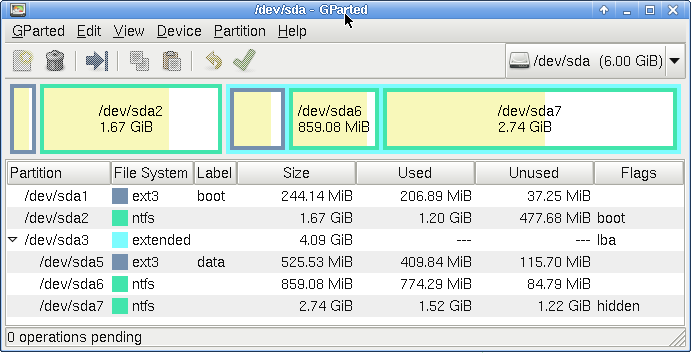

dimdecode
: Desktop Management Interface
* Doesnt query and probe the hardware
* queries System Managed BIOS, hence info could be unreliables

OEM
: Original Equipment Manufacturer

Device Driver
: a computer program that operates or controls a particular type of device that is attached to a computer.
<!-- more -->


sudo dmidecode [[[--dev-mem /dev/mem]]]
sudo dmidecode [[[--type]]] memory

sudo lshw -class memory


1. Query
2. There are 42 types refer man dmidecode
   1. `--type` flag could take following values
   2. bios, system, baseboard, chassis, processor, memory, cache, connector, slot


cat [[[/proc/cmdline]]]
root=/dev/mmcblk0p2 init=/sbin/init.sh


1. From proc filesystem

* Linux is easily portable to most general-purpose 32- or 64-bit architectures as long as they have a paged memory management unit (PMMU) and a port of the GNU C compiler (gcc) (part of The GNU Compiler Collection, GCC).
* Linux has also been ported to itself. You can now run the kernel as a userspace application - this is called ***UserMode Linux (UML)**
* To configure and build the kernel, use[^3]
   1. make menuconfig
* The kernel’s command-line parameters, basically its a very big and complicated CLI program
* `xz`, a lossless data compression file format based on the **LZMA algorithm**, often with the file extension ".xz"
* **PTY** - Pseudo terminals
* Writing drivers for linux systems

## Drivers - Kernel Programming

> Could be a physical device or a virtual device (like a Instance of device)

Block Device driver
: any device which has a filesystem on it
* provides you random access to date to traverse back and forth

Character Driver
: stream of data to be processed
* Keyboard and Mouse

> Kernal provides ways to load and release drivers from user space. Like flashdrive driver


## Memory RAM

* Works on `pages`, which are written and read very fast by system
* `virtual memory` space borrowed from **HDD** to store pages which do not change frequently


> Can I mix and match memories? Like samsung and kingston

You **may/maynot** run into compatibilty issues sue to specs followed by vendors
BUy RAM with same speeds

---

x86
: x86 is an Intel CPU architecture that originated with the 16-bit 8086 processor
in 1978. Today, the term "x86" is used generally to refer to any 32-bit processor
compatible with the x86 instruction set.

UEFI - Unified Extensible Firmware Interface
: specification that defines softeware interface between OS and firmware[^1]
* UEFI replaces the Basic Input/Output System (BIOS) firmware interface
* UEFI can support **remote** diagnostics and repair of computers, even with <mark>no operating system installed</mark>

Emulation
: refers to the ability of a computer program in an electronic device to emulate (or imitate) another program or device[^2]

ISA - instruction set architecture
: is the abstract model of computer[^5]

ESP[^10]
: EFI System Partition
* is a data storage device

EFI
: Extensible Firmware Interface

s-video
: separate video is a signaling standard for standard definition video

> configuration to boot from old BIOS mode or UEFI mode

[What is the difference in “Boot with BIOS” and “Boot with UEFI”](https://superuser.com/questions/496026/what-is-the-difference-in-boot-with-bios-and-boot-with-uefi)


## QEMU - Quick Emulation[^3]

* open source emulator that performs hardware virtualization
* can emulate a variety of processor types
* Uses binary translation[^4] to convert instruction sets from source to target
* can be used with KVM to run virtual machines at near-native speed (by taking advantage of hardware extensions such as Intel VT-x)

> QEMU vs Virtualbox

1. QEMU/KVM is better integrated in Linux, has a smaller footprint and should therefore be faster.
2. VirtualBox is a virtualization software limited to x86 and amd64 architecture
3. Xen uses QEMU for the **hardware assisted virtualization**[^7], but can also paravirtualize guests without hardware virtualisation.
4. QEMU supports a wide range of hardware and can make use of the KVM when running a target architecture which is the same as the host architecture.
5. Xen is a Type-1 hypervisor[^6] where VirtualBox and QEMU are considered as Type-2 hypervisors (also there might be a debate considering kvm being a kernel module).

## KVM - Kernel-based Virtual Machine

1. KVM which is an accelerator(linux kernel module which enables the guest instruction to run directly on the host CPU)
   1. which makes Qemu+KVM a faster solution, unlike the slower alternative of Qemu+TCG.
2. full virtualization solution for Linux on x86 hardware containing virtualization extensions (Intel VT or AMD-V)
3. It consists of a loadable kernel module, kvm.ko, that provides the core virtualization infrastructure and a processor specific module, **kvm-intel.ko** or **kvm-amd.ko**[^8].
4. Using KVM, one can run multiple virtual machines running unmodified Linux or Windows images. Each virtual machine has private virtualized hardware: a network card, disk, graphics adapter, etc.
5. The kernel component of KVM is included in mainline Linux, as of 2.6.20. The userspace component of KVM is included in mainline QEMU, as of 1.3.

> [Is KVM type 1 hypervisor or type 2?](https://serverfault.com/questions/855094/is-kvm-a-type-1-or-type-2-hypervisor)

### UEFI ADvantages

1. Support for HDDs with more than 2.1 TBytes

> [Difference between wic and hddimg format in yocto](https://stackoverflow.com/questions/49527057/difference-between-wic-and-hddimg-format-in-yocto)

* Generally a .wic image is intended to be installed directly to its final destination, whereas an hddimg is for evaluation and installation elsewhere.
* By default meta-intel .wic images only have an EFI bootloader, and will not boot via legacy BIOS.
* An hddimg will have both an EFI bootloader and the syslinux binaries that let it boot from legacy BIOS.
*


## GRUB - Grand unified bootloader

* is a second stage multi-boot loader.
* GUID Partition Table (GPT)
* First, install the packages grub and **efibootmgr**: GRUB is the bootloader while efibootmgr is used by the GRUB installation script to write boot entries to NVRAM.
* `/etc/default/grub`


> How to boot a linux device in low resolution mode? Boot option to set resolution?

[16.04 LTS does not boot, graphic resolution on screen low](https://www.labdoo.org/content/1604-lts-does-not-boot-graphic-resolution-screen-low)

{}
    cat /proc/cmdline
{}

> HOw to change priority of display in BIOS?

VGA - DVI - HDMI - then finally DP (basically oldest to newest)

## FS Partitioning Basics



* https://help.ubuntu.com/community/HowtoPartition/PartitioningBasics
* Max number of primary partition = **4**
* It is a limitation of MBR not linux OS
* If you want more partitions, you can create three primary and one extended partition. Inside extended partition, you can create as many logical partitions.

## Create partition from yocto

1. In `local.conf` file add
   1. `WKS_FILE = "mastercontrolimage-genericx86.wks"`
2. `wks` creates Kickstart file


### How to list partitions

lsblk
: lists all the block devices of your system along with their logical partitions
* `lsblk --fs`
* `lsblk --topology`
* `lsblk --`

```
sudo fdisk -l
sudo sfdisk -l

df -h
pydf
hwinfo
```


Name-Name of the devices

Maj:Min-Major and Min Device numbers

RM-Whether the device is removable(1) or not (0)

Size-Size of the device

RO-Is the device read-only(1) or not (0)

Type-Type of device, i.e, if it is a disk or partitions, etc.

MountPoint-The mount point of the device(if applicable).

[Active partition contains OS](http://www.linfo.org/active_partition.html)

## Mender

Mender uses the double partition layout: the device will have at least 2 rootfs partitions, one active and one inactive. Mender will deploy an update on the inactive partition, so that in case of an error during the update process, it will still have the active partition intact. If the update succeeds, it will switch to the updated partition: the active partition becomes inactive and the inactive one becomes the new active. As the kernel and the device tree are stored in the /boot folder of the root filesystem, it is possible to easily update an entire system. Note that Mender needs at least 4 partitions:

bootloader partition
data persistent partition
rootfs + kernel active partition
rootfs + kernel inactive partition

- binary rootfs file system image (e.g. with .mender
-

* bootloader integration (required for dual A/B updates) has been the most challenging part of adopting Mender.
  * abstracted out the x86 support using the UEFI framework

```
systemctl status mender

mender -rootfs /mnt/usb/testUpdate.mender
mender -commit skysails-mastercontrol-image-genericx86-64.mender
mender -debug --rootfs test-image-pynq-z1.mender
mender -debug -rootfs ./skysails-mastercontrol-image-genericx86-64.mender -skipverify
```

It can happen if your U-Boot 'mender_boot_part' environment variable is
unset or wrong. Can you verify that it has the correct value with
'fw_printenv'? It should be a number, not a '/dev' reference.

This can also happen if 'mender_boot_part' doesn't match what is in your
currently mounted filesystem list. Check the output of 'mount' and
verify that it matches what is in the U-Boot variable (except that
mount's version *will* be a '/dev' reference).

[boot partition](https://en.wikipedia.org/wiki/System_partition_and_boot_partition)

### Help and resources

+ [Google Groups](https://groups.google.com/a/lists.mender.io/forum/#!forum/mender)
+


### Footnotes

[^1]: [wiki, UEFI](https://en.wikipedia.org/wiki/Unified_Extensible_Firmware_Interface)
[^2]: [wiki, Emulator](https://en.wikipedia.org/wiki/Emulator)
[^3]: [wiki, QEMU](https://en.wikipedia.org/wiki/QEMU)
[^4]: [wiki, Binary translation](https://en.wikipedia.org/wiki/Binary_translation)
[^5]: [wiki, ISA](https://en.wikipedia.org/wiki/Instruction_set_architecture)
[^6]: [wiki, Hypervisor or VMM - virtual machien manager](https://en.wikipedia.org/wiki/Hypervisor)
[^7]: [wiki, hardware assistred virtualization](https://en.wikipedia.org/wiki/Hardware-assisted_virtualization)
[^8]: [linux-kvm.org](https://www.linux-kvm.org/page/Main_Page)
[^9]: [kvm offical forum/blog](https://planet.virt-tools.org/)
[^10]: [wiki, EFI_system_partition](https://en.wikipedia.org/wiki/EFI_system_partition)
[^11]: [wiki, s-video](https://en.wikipedia.org/wiki/S-Video)
[^12]: [Kernel | microkernel | linux](https://github.com/nu11secur1ty/Kernel-and-Types-of-kernels)
[^13]: [OS Comparision](https://en.wikipedia.org/wiki/Comparison_of_operating_system_kernels)
[^14]: https://www.kernel.org/doc/html/v4.10/admin-guide/README.html?highlight=device%20tree
[Detailed Look at the Boot Process](https://www-uxsup.csx.cam.ac.uk/pub/doc/redhat/redhat8/rhl-rg-en-8.0/s1-boot-init-shutdown-process.html)
