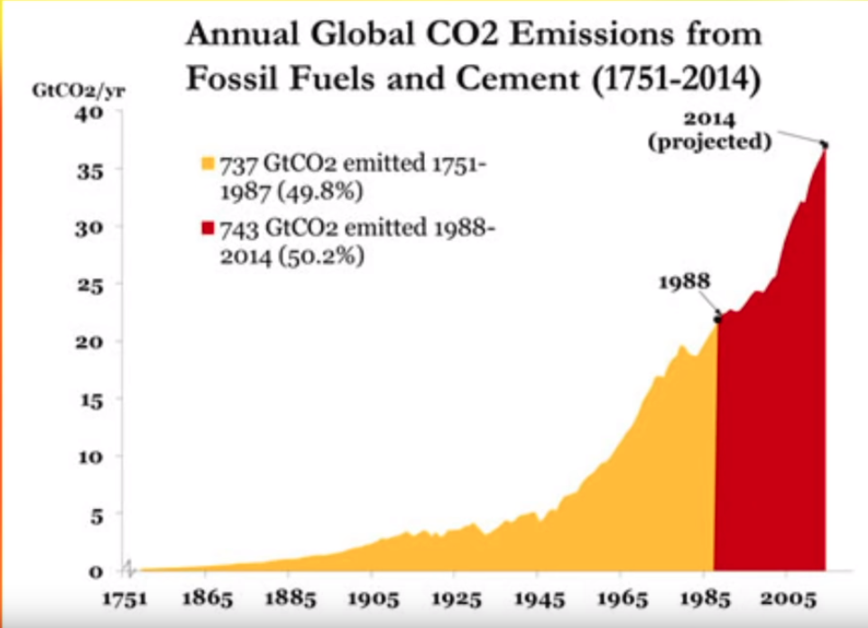
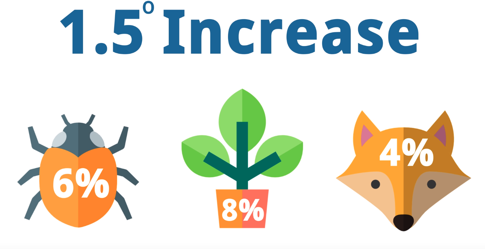
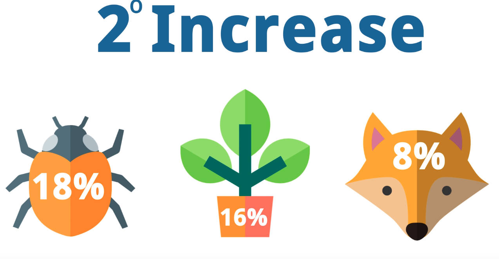

IPCC
: Intergovernmental Panel on Climate Change

SPM
: Summary for policymakers

* effect on global warming due to human induced factors
* The guardian newspaper
* Founded in 1988
* Takes scientific data various individual scientists
* cites 6000 scientif reports
<!-- more -->

## Report Finding

* Temperature data vs time graph
* Sice 1988 after climate cxhange effect was brough to UN, CO2 emission has increases instead of reduing
* A small shift by 1 degree celcisu can make catastropic changes

* Presents 3 scenarios
* What kind of changes we should expect if we do not change our ways?

* Just 100 companies are responsible for 71% of CO2 emission[^1]

## What are the problems

1. Desertification
2. Land degradation
3. food security
4. Greenhouse gas fluxes in terrestial ecosystems

## Factors

1. Greenhouse gases - `Co2`
2. Deforestation
3. Ozone layer depletion

## How can we metigate?

1. Afforestatiom
2. Leave fossil fuel in the ground
3. Shift to electric vehicles
4. Reduced meat consumption - eco friendly low fingerprint diet
5. Paris Agreements

### Footnotes

[^1]: https://b8f65cb373b1b7b15feb-c70d8ead6ced550b4d987d7c03fcdd1d.ssl.cf3.rackcdn.com/cms/reports/documents/000/002/327/original/Carbon-Majors-Report-2017.pdf?1499866813
[^2]:
